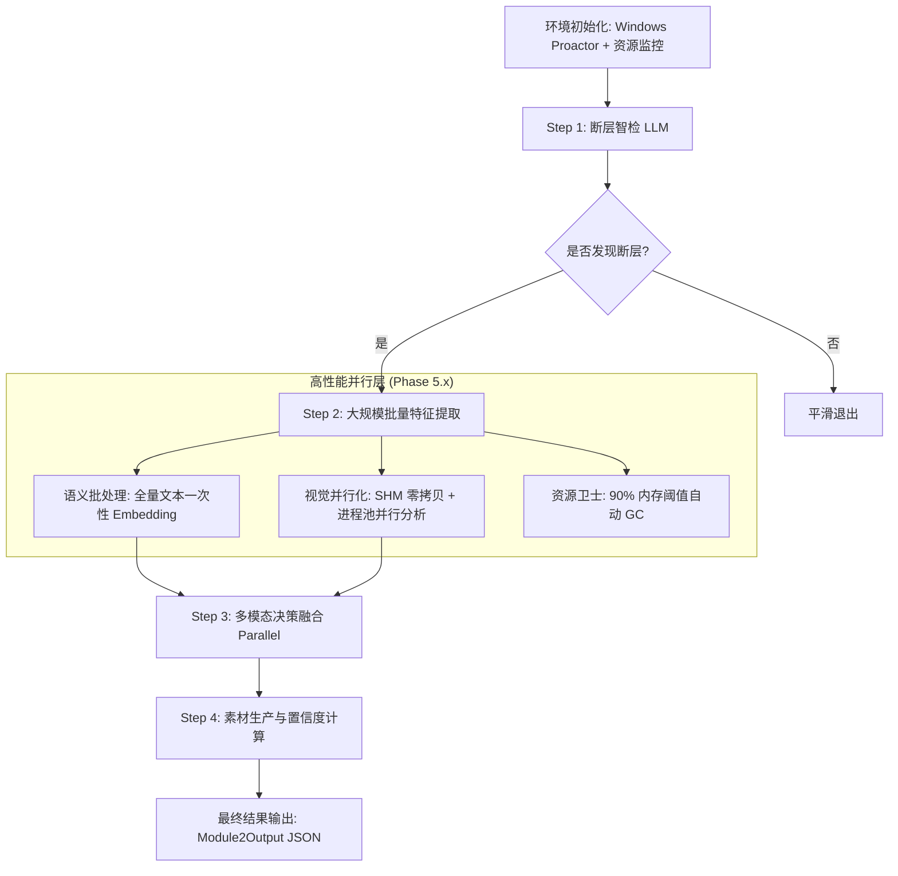

# E2E 流水线编排逻辑与性能设计总结

本文档归档了 `test_e2e_pipeline.py` 的核心设计思路，重点阐述在 Phase 5.x 性能优化后的“四层编排架构”。

## 1. 核心流程图 (Mermaid)

## 2. 极致性能设计原则 (第一性原理)

### 2.1 零拷贝通信 (Zero-Copy IPC)
- **挑战**：Windows 下进程间传输 1080P 视频帧（约 6MB/帧）会产生巨大的 Pickle 序列化开销。
- **方案**：使用 `SharedFrameRegistry`。主进程将帧写入共享内存段，子进程仅传递内存地址。
- **效果**：视觉分析速度提升 3-5 倍，消除 CPU 序列化峰值。

### 2.2 推理合并 (Inference Batching)
- **挑战**：单条文本调用 BERT 会受到 PyTorch 库调度的显著开销（Overhead）。
- **方案**：流水线在 Step 2 收集所有候选断层的“故障文本+上下文”，通过 `batch_get_embeddings` 执行一次 30-100 batch 的推理。
- **效果**：语义编码耗时从秒级优化至毫秒级。

### 2.3 阶段并发 (Phased Concurrency)
- **挑战**：完全乱序的并发会导致磁盘 I/O 争抢和深度学习模型竞争。
- **方案**：采用“阶段同步，内部并发”策略。
    - **整体**：智检 -> 特征提取 -> 素材生成。
    - **内部**：使用 `asyncio.gather` + `Semaphore(4)` 控制特定阶段的并发密度。

## 3. 稳健性保障 (Robustness)

- **主动预判 (Proactive Extension)**：在正式分析前通过快速采样识别高复杂度（如 PPT 翻页）场景，主动调整窗口，避免重复计算。
- **资源监控 (OOM Guard)**：实时监控物理内存，当可用空间不足时，自动触发 `gc.collect()` 或降低检测精度，优先保证 Pipeline 能够走完流程。
- **结果记忆 (Cache-Aware)**：语义嵌入和置信度计算均具备哈希缓存，确保“同输入，零二次计算”。

---
**归档日期**：2026-01-25  
**版本**：Phase 5.2 (Performance Finalized)
