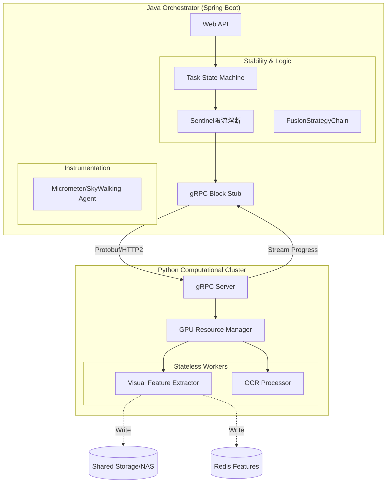

# Java 编排与交互设计深化方案 (Refined Spec)

**参考文档**: `JAVA调度和python计算的分析.md`
**核心目标**: 落实 "Java 编排，Python 计算" 的企业级落地细节，强化 **高可用 (Resilience)**、**可观测 (Observability)** 和 **高性能交互 (High-Perf Interaction)**。

---

## 1. 交互模式设计 (Interaction Mode)

为了满足 "二进制高效传输" 和 "标准接口定义"，我们采用 **分层交互协议**。

### 1.1 通信协议选型：HTTP/2 + Protobuf (或高效 JSON)

*   **推荐方案**: **gRPC (基于 HTTP/2)**
    *   **理由**: 符合文档提到的 "二进制数据传输" 需求；强类型契约 (.proto) 避免 Python/Java 字段对不齐；支持双向流 (Streaming)，方便 Python 实时回传处理进度。
    *   **Fallback 方案**: **Spring WebClient (HTTP/1.1) + MsgPack** (如果团队 gRPC 运维成本过高)。

### 1.2 接口契约定义 (API Contract)

我们定义 `ComputationService` 的 gRPC 接口：

```protobuf
service ComputationService {
    // 提交视频分析任务 (异步)
    rpc SubmitAnalysis (AnalysisRequest) returns (AnalysisResponse);
    
    // 获取任务状态 (轮询/流式)
    rpc GetAnalysisStream (TaskQuery) returns (stream TaskProgress);
}

message AnalysisRequest {
    string task_id = 1;
    string video_path = 2; // 共享存储路径，遵循 "传引用" 原则
    AnalysisConfig config = 3;
}

message AnalysisResponse {
    bool accepted = 1;
    string estimated_time = 2;
}

message TaskProgress {
    string task_id = 1;
    int32 percent = 2;
    // 关键特征数据 (结构化)
    VisualFeatures visual_features = 3; 
    // 大对象引用 (如截图路径)
    string screenshot_path = 4; 
}
```

---

## 2. Java 编排层详细设计 (Java Orchestration Design)

Java 层不仅仅是调用者，更是系统的 **"稳定器" (Stabilizer)**。

### 2.1 弹性熔断与限流 (Resilience Layer)

为了防止 Python 计算节点（可能是 GPU）过载，Java 端必须实施保护。
*   **技术选型**: **Alibaba Sentinel** (推荐，国产适配好) 或 **Resilience4j**。
*   **设计策略**:
    *   **限流 (Rate Limiting)**: 限制对 CV 服务的并发调用数 (如 max 5 concurrent calls)，防止 GPU 显存溢出 (OOM)。
    *   **熔断 (Circuit Breaking)**: 当 Python 服务连续超时或报错 (如 CUDA Error) 超过 5 次，Java 自动熔断 30秒，期间请求直接降级 (Fallback) 处理，避免级联雪崩。
    *   **降级策略 (Fallback)**: 如果 CV 分析挂了，降级为 "仅做纯文本分析" (OCR/ASR)，保证业务基本可用性。

### 2.2 状态机管理 (Lifecycle Management)

复杂的异步长流程必须引入状态机。
*   **技术选型**: **Spring StateMachine** 或轻量级 **Enum State Pattern**。
*   **状态流转**:
    ```mermaid
    stateDiagram-v2
        [*] --> PENDING: 任务提交
        PENDING --> DISPATCHED: 调度至Python
        DISPATCHED --> PROCESSING: Python开始计算
        PROCESSING --> FEATURE_READY: 特征回传完成
        FEATURE_READY --> ANALYZING: Java执行决策链
        ANALYZING --> COMPLETED: 最终结果落库
        
        PROCESSING --> FAILED: 计算超时/报错
        FAILED --> RETRYING: 触发重试策略
        RETRYING --> DISPATCHED
    ```

### 2.3 链路追踪 (Observability)

确保这一条很长的调用链可追溯。
*   **技术选型**: **Micrometer Tracing (Brave/Otel)** + **SkyWalking**。
*   **实现**:
    *   Java 生成 `TraceID`。
    *   通过 gRPC Metadata 传递给 Python。
    *   Python 侧集成 OpenTelemetry，打印日志时带上该 `TraceID`。
    *   **效果**: 在 SkyWalking 界面能看到：`Web(Java) -> Service(Java) -> gRPC(Python worker) -> OpenCV(Python)` 的完整耗时瀑布图。

---

## 3. 增强后的架构图 (Refined Architecture)



## 4. 落地步骤建议

1.  **定义 .proto**: 这是一个关键的契约文件，Java 和 Python 团队必须共同评审。
2.  **Java Client 封装**: 创建一个 `@Service`，包装 gRPC stub，加上 `@SentinelResource` 注解。
3.  **Python Server 改造**: 将原来的脚本改为 `grpc.server`，在一个线程池中响应请求。
4.  **压测熔断**: 故意关掉 Python 服务，验证 Java 端是否能正常降级，不报 500 错误。
