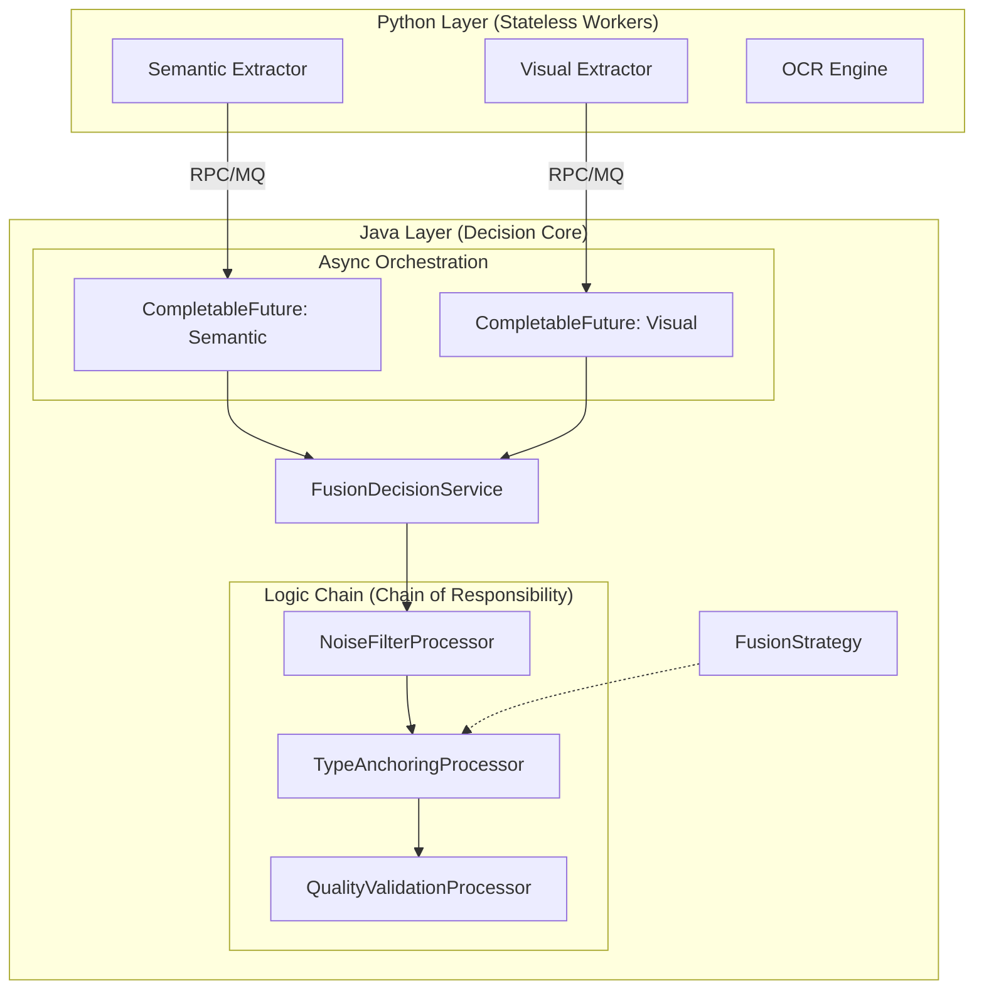

# Java 重构方案归档：基于第一性原理的工程架构

**日期**: 2026-01-27
**模块**: MVP Module 2 (Content Enhancement)
**状态**: 已验证 / 待集成

---

## 1. 重构的第一性原理 (First Principles of Refactoring)

本次重构并非单纯的语言迁移，而是基于以下工程第一性原理对系统架构的重新思考：

### 1.1 职责分离原则 (Separation of Concerns)
*   **原理**: 计算密集型任务（Feature Extraction）与逻辑密集型任务（Decision Making）由于资源消耗模式不同（CPU/GPU vs CPU/IO），必须物理分离。
*   **决策**:
    *   **Python**: 退化为纯粹的 **"计算算子" (Operator)**。利用其丰富的 AI 生态（PyTorch, OpenCV）专注于提取语义向量和视觉特征。无状态，无业务感知。
    *   **Java**: 升级为 **"业务大脑" (Controller)**。利用其强类型系统和并发优势，负责复杂的业务规则编排、状态流转和结果持久化。

### 1.2 开放封闭原则 (Open-Closed Principle)
*   **原理**: 业务规则（如"如何判断是否视频"）会随产品迭代频繁变更，但核心流程（过滤->定锚->校验）应保持稳定。架构必须支持"不修改原有代码的情况下扩展新规则"。
*   **决策**:
    *   引入 **责任链模式 (Chain of Responsibility)** 与 **策略模式 (Strategy Pattern)**，将硬编码的 `if-else` 解耦为独立的 Processor 类。

### 1.3 高吞吐与低延迟 (High Throughput & Latency Hiding)
*   **原理**: 多模态特征提取（OCR, ASR, Visual）涉及多次独立的 IO 或计算调用，串行执行是性能杀手。
*   **决策**:
    *   使用 Java 的 `CompletableFuture` 构建 **全异步编排**。在等待 Python Worker 返回特征的同时，不阻塞主线程，极大提升吞吐量。

---

## 2. 架构设计 (Architecture Design)

### 2.1 混合架构图



---

## 3. 核心代码映射 (Code Implementation Mapping)

项目路径: `java_refactoring/src/main/java/com/mvp/module2/fusion/`

### 3.1 领域模型 (Domain Model) - 显性化契约
*   **文件**: `model/SemanticFeatures.java`, `model/VisualFeatures.java`
*   **价值**: 将 Python 中隐式的字典结构 (`dict`) 转化为 Java 强类型对象，在编译期杜绝字段拼写错误，明确上下游交互契约。

### 3.2 决策流水线 (Decision Pipeline) - 逻辑解耦
*   **文件**: `chain/DecisionProcessor.java`
*   **实现**:
    *   **`NoiseFilterProcessor`**: 对应第一性原理中的 "信噪比控制"。
    *   **`TypeAnchoringProcessor`**: 对应第一性原理中的 "认知定锚" (Process=Video, Spatial=Screenshot)。
    *   **`QualityValidationProcessor`**: 对应第一性原理中的 "质量兜底"。

### 3.3 异步编排 (Concurrency) - 性能释放
*   **文件**: `service/FusionDecisionService.java`
*   **代码片段**:
    ```java
    public CompletableFuture<MultimodalDecision> decideAsync(...) {
        // 编排并行任务，等待所有特征就绪后触发决策链
        return semanticFuture.thenCombine(visualFuture, (semantic, visual) -> {
            FusionContext context = new FusionContext(clipId, semantic, visual, 5.0); // assume 5s duration
            pipeline.process(context); // 触发责任链
            return context.getDecision();
        });
    }
    ```

---

## 4. 面试技术亮点总结

1.  **架构演进**: 从 "脚本化" 到 "服务化"，展示了对大规模工程落地的思考。
2.  **设计模式**: 恰到好处地使用了责任链（流程解耦）和策略模式（规则扩展），避免了过度设计。
3.  **并发编程**: 展示了对 Java 8+ 异步 API 的熟练掌握，解决了 AI 工程中常见的 IO 瓶颈问题。
