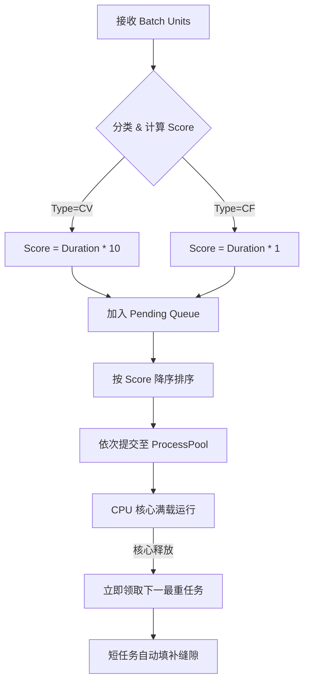

# Python CV Worker 调度优化：加权 LPT 策略

**版本**: V1.0  
**日期**: 2026-02-04  
**状态**: 已实施  

## 1. 背景与问题

### 现状
在 `python_grpc_server.py` 的 `ValidateCVBatch` 阶段，系统接收来自 Java 端的一批 `SemanticUnit` 进行并行处理。这批任务包含两种截然不同的类型：
1.  **CV (Process/Practical)**: 计算密集型，耗时长（需 OpenCV/SSIM/OCR）。
2.  **CF (Abstract/Explnation)**: IO 密集型，耗时极短（仅截图/哈希）。

### 痛点：长尾等待 (Long Tail Latency)
原始调度采用 **FCFS (First-Come-First-Serve)** 或随机提交。如果任务队列中混杂了耗时的 CV 任务和快速的 CF 任务，且提交顺序不佳（例如先提交了一堆短任务，最后提交长任务），会导致以下后果：
*   **资源空转**: 当这批短任务快速完成后，大部分 CPU 核心处于空闲状态，只能等待最后那个“长任务”慢慢跑完。
*   **总耗时增加**: 整个 Batch 的完成时间 (Makespan) 取决于最晚结束的那个任务。如果最重的任务最后才开始跑，总耗时 = 前序等待时间 + 任务执行时间。

---

## 2. 解决方案：加权 LPT (Weighted Longest Processing Time)

我们引入了 **加权最长处理时间优先** 调度策略。核心思想是：**“先搬大石头，后填细沙”**。

### 核心公式
对每个任务计算调度分值 (`Score`)，并按分值 **降序 (Descending)** 排列提交：

$$Score = Duration \times Weight$$

*   **Duration**: 视频片段时长 (`end_sec - start_sec`)。
*   **Weight**: 任务类型权重。
    *   **CV 任务 (Process/Practical)**: `Weight = 10` (高权重，优先抢占)
    *   **CF 任务 (Abstract/Explanation)**: `Weight = 1` (低权重，作为填充)

### 执行流程图



---

## 3. 预期收益

1.  **消除空转**: 最困难的任务最先被所有 CPU 核心抢占，无论该任务在原始列表的哪个位置。
2.  **最小化 Makespan**: 理论上，LPT 策略能将多处理器调度的总耗时压缩至接近最优解（由工作量最大的单体任务或总负载决定）。
3.  **鲁棒性**: 即使上游（Java）发来的 Batch 只有少量任务，Python 端也能确保这少量任务中的“大块头”先被处理。

## 4. 代码实现关键点

位于 `python_grpc_server.py` -> `ValidateCVBatch` -> `Phase 2: Compute`。

```python
# 1. 收集并打分
pending_tasks.append({
    "score": duration * 10.0, # CV High Weight
    "type": "cv",
    ...
})

# 2. 排序
pending_tasks.sort(key=lambda x: x["score"], reverse=True)

# 3. 提交
for t in pending_tasks:
    loop.run_in_executor(...)
```

---

## 5. Q&A

**Q: 上游 Java 分批发送是否影响此策略？**  
A: 是的。如果 Java 把一个大任务拆成 10 个小 Batch 发送，Python 只能在每个小 Batch 内部进行局部优化。但考虑到 Python 端目前是每一轮 RPC 内部做排序，所以 **Input Batch 越大，优化效果越明显**。建议 Java 端在内存允许范围内尽可能发送大 Batch（全量发送）。

**Q: 结果顺序是否会打乱？**  
A: 提交顺序因为排序变了，`future` 的完成顺序也是乱的。但上游 Java 是根据 `unit_id` 来匹配结果的，因此返回结果的列表顺序并不影响正确性（或者我们可以在 Python 端最后按 ID 重组，目前协议允许乱序列表返回）。
