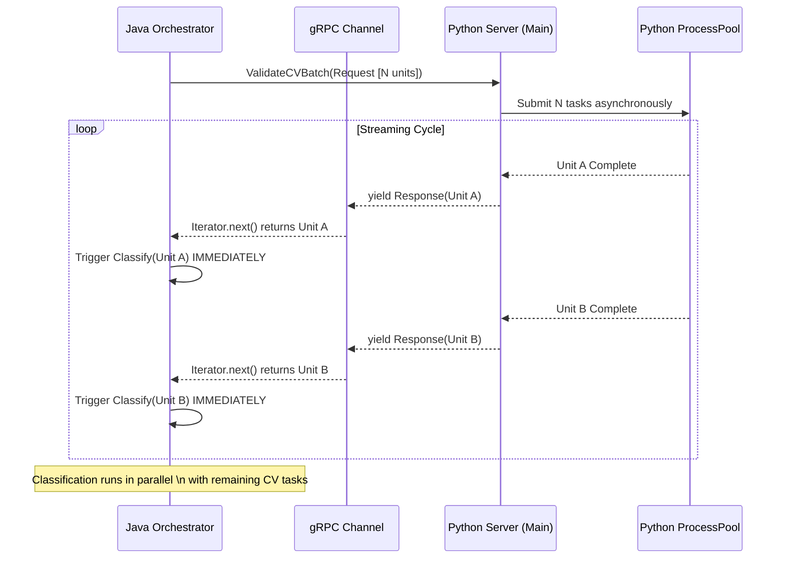

# 工程化优化：Server Streaming 流式响应架构

## 1. 背景与问题 (Background & Problem)

在视频处理流水线中，**CV 验证 (CV Validation)** 是一个 CPU 密集型且耗时差异巨大的任务。
在此前的架构中，Java 端通过 gRPC 调用 Python 的 `ValidateCVBatch` 接口时，采用的是 **Unary (应答式)** 模式：
1. Java 发送一个包含 N 个语义单元 (Semantic Units) 的 Batch。
2. Python 并行处理这 N 个单元。
3. Python **必须等待所有 N 个单元全部完成**，才一次性将结果列表返回给 Java。
4. Java 收到结果后，才开始调度后续的 **知识分类 (Knowledge Classification)** 任务。

**主要瓶颈 (Pain Point): Head-of-Line Blocking (队头阻塞)**
*   如果 Batch 中包含一个耗时极长的单元（例如长片段或复杂场景），整个 Batch 的返回会被该单元“卡住”。
*   此时，其他早已处理完毕的单元无法进入下一阶段，导致 Java 端的 LLM 资源闲置，流水线出现明显的空闲气泡 (Idle Bubbles)。

---

## 2. 解决方案：gRPC Server Streaming + 增量编排

我们引入了 **Server Streaming (服务端流式)** 架构，结合 Java 端的 **增量编排 (Incremental Orchestration)**，实现了“滚动式”流水线。

### 架构图示



---

## 3. 技术实现细节 (Implementation Details)

### 3.1 Python 端：异步生成器 (Async Generator)

我们将 `ValidateCVBatch` 改造为 Python 的 **异步生成器**，利用 `asyncio.as_completed` 实现结果的即时回传。

*   **核心逻辑**:
    *   接收请求后，立即将 N 个任务并行提交给 `ProcessPoolExecutor`。
    *   不使用 `asyncio.gather` (它会等待所有)，而是使用 `asyncio.as_completed` 包装 Future 列表。
    *   每当一个 Future 完成，就立刻处理该结果，并通过 `yield` 关键字向 gRPC 流写入一个 `CVValidationResponse`。
*   **代码摘要**:
    ```python
    # 包装任务以携带元数据
    wrapped_tasks = [wrap_task(f[2], f[0], f[1]) for f in all_futures]
    
    # 迭代完成的任务流
    for completed_coro in asyncio.as_completed(wrapped_tasks):
        type, uid, res = await completed_coro
        # 构建 Protocol Buffer 对象
        pb_result = _build_pb_result(res)
        # 立即流式返回
        yield video_processing_pb2.CVValidationResponse(results=[pb_result])
    ```

### 3.2 Java 端：Iterator 消费与增量编排

Java 端利用 gRPC BlockingStub 返回的 `Iterator<CVValidationResponse>` 进行流式消费，并重构了编排器以支持回调。

*   **gRPC Client 改造 (`PythonGrpcClient.java`)**:
    *   接口签名变更：接受一个 `Consumer<CVValidationUnitResult> resultConsumer` 回调函数。
    *   使用 `while (iterator.hasNext())` 循环读取流。
    *   每读到一个响应，立即解析如果不为空，调用 `resultConsumer.accept(unitResult)`。

*   **编排器改造 (`VideoProcessingOrchestrator.java`)**:
    *   不再等待 `validateBatchesAsync` 返回完整的 `CVBatchResult` 列表。
    *   定义回调逻辑：收到一个 `unitResult` 后，**立即** 组装对应的 `ClassificationInput`，并提交 `knowledgeOrchestrator.classifyBatchAsync` 任务。
    *   **滚动加载**: 实现了 CV 处理（上一阶段）与 知识分类（下一阶段）的 **Pipeline Parallelism (流水线并行)**。

### 3.3 并发与同步控制 (Concurrency & Safety)

为了在多线程流式环境下保证安全，采用了以下策略：

1.  **Concurrent Collection**:
    *   `cvResults` 使用 `ConcurrentHashMap` 存储，支持并发写入。
    *   `allFutures` (用于追踪所有衍生的分类任务) 使用 `Collections.synchronizedList` 包装，防止在遍历或添加时发生竞争。

2.  **两级等待机制 (Two-Stage Wait)**:
    *   **Stage 1**: 等待 **CV 流结束**。使用 `CompletableFuture.allOf(cvFutures)`。这确保了 Python 端的生成器已经关闭，所有 CV 结果都已到达 Java。
    *   **Stage 2**: 等待 **衍生任务结束**。由于 CV 回调会动态向 `allFutures` 添加新的分类任务，我们在 CV 流结束后，通过一个 `while` 循环反复检查 `allFutures` 中是否有未完成的任务 (pending)，直到所有衍生的分类任务全部执行完毕。

---

## 4. 收益评估 (Benefits)

1.  **降低延迟 (Latency Reduction)**:
    *   首个语义单元的“知识分类”任务启动时间，从“由于 Batch 最慢单元决定”提前到了“该单元自身 CV 完成时刻”。
    
2.  **提升吞吐量 (Throughput)**:
    *   Python 的 CV Worker (CPU密集) 和 Java 的 LLM Caller (IO等待) 实现了重叠执行。
    *   在长视频处理中，流水线更加紧凑，减少了 CPU 和 网络资源的空闲时间。

3.  **资源利用率 (Efficiency)**:
    *   平滑了 LLM 请求的瞬时并发峰值（不再是 Batch 完成后瞬间爆发 N 个请求，而是随着 CV 完成平滑触发），有助于降低 LLM Rate Limit 风险。

## 5. 总结

本次重构通过引入 Server Streaming，成功解决了 "Head-of-Line Blocking" 问题，将原来的 **"Sync-Batch" (同步批处理)** 模型升级为 **"Async-Streaming-Pipeline" (异步流式流水线)** 模型，显著增强了系统的实时性和处理效率。
