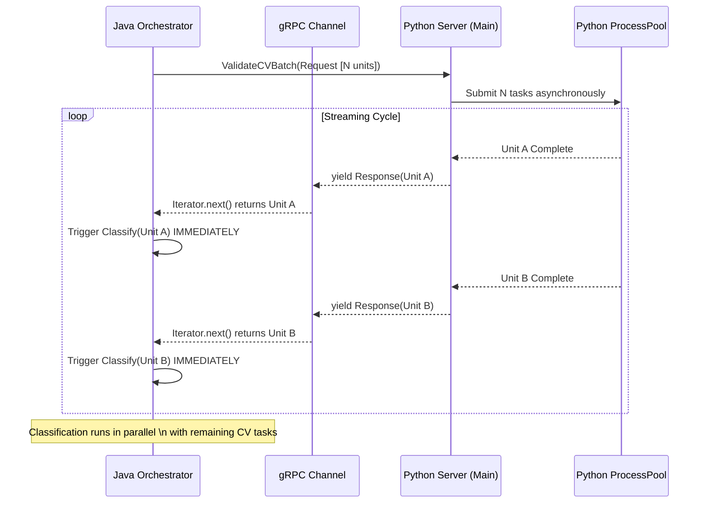

# 工程化优化：Server Streaming 流式响应架构

## 1. 背景与问题 (Background & Problem)

在视频处理流水线中，**CV 验证 (CV Validation)** 是一个 CPU 密集型且耗时差异巨大的任务。
在此前的架构中，Java 端通过 gRPC 调用 Python 的 `ValidateCVBatch` 接口时，采用的是 **Unary (应答式)** 模式：
1. Java 发送一个包含 N 个语义单元 (Semantic Units) 的 Batch。
2. Python 并行处理这 N 个单元。
3. Python **必须等待所有 N 个单元全部完成**，才一次性将结果列表返回给 Java。
4. Java 收到结果后，才开始调度后续的 **知识分类 (Knowledge Classification)** 任务。

**主要瓶颈 (Pain Point): Head-of-Line Blocking (队头阻塞)**
*   如果 Batch 中包含一个耗时极长的单元（例如长片段或复杂场景），整个 Batch 的返回会被该单元“卡住”。
*   此时，其他早已处理完毕的单元无法进入下一阶段，导致 Java 端的 LLM 资源闲置，流水线出现明显的空闲气泡 (Idle Bubbles)。

---

## 2. 解决方案：gRPC Server Streaming + 增量编排

我们引入了 **Server Streaming (服务端流式)** 架构，结合 Java 端的 **增量编排 (Incremental Orchestration)**，实现了“滚动式”流水线。

### 架构图示



---

## 3. 技术实现细节 (Implementation Details)

### 3.1 Python 端：异步生成器 (Async Generator)

我们将 `ValidateCVBatch` 改造为 Python 的 **异步生成器**，利用 `asyncio.as_completed` 实现结果的即时回传。

*   **核心逻辑**:
    *   接收请求后，立即将 N 个任务并行提交给 `ProcessPoolExecutor`。
    *   不使用 `asyncio.gather` (它会等待所有)，而是使用 `asyncio.as_completed` 包装 Future 列表。
    *   每当一个 Future 完成，就立刻处理该结果，并通过 `yield` 关键字向 gRPC 流写入一个 `CVValidationResponse`。
*   **代码摘要**:
    ```python
    # 包装任务以携带元数据
    wrapped_tasks = [wrap_task(f[2], f[0], f[1]) for f in all_futures]
    
    # 迭代完成的任务流
    for completed_coro in asyncio.as_completed(wrapped_tasks):
        type, uid, res = await completed_coro
        # 构建 Protocol Buffer 对象
        pb_result = _build_pb_result(res)
        # 立即流式返回
        yield video_processing_pb2.CVValidationResponse(results=[pb_result])
    ```

### 3.2 Java 端：Iterator 消费与增量编排

Java 端的流式机制主要通过 **gRPC 的 BlockingStub Iterator** 配合 **Java 的 Callback 回调** 实现。具体分为三层实现：

#### A. 底层：gRPC 迭代器消费 (`PythonGrpcClient.java`)
不同于应答式调用等待整个 List，我们利用 gRPC 生成的代码接口返回的 `Iterator`。

```java
// 1. 调用 gRPC 接口，立即获得一个迭代器 (Iterator)，此时请求已发送不阻塞
Iterator<CVValidationResponse> responseIterator = blockingStub
    .withDeadlineAfter(timeoutSec, TimeUnit.SECONDS)
    .validateCVBatch(request);

// 2. 循环读取流 (hasNext() 会阻塞直到 Python 有新数据 yield 过来)
while (responseIterator.hasNext()) {
    CVValidationResponse response = responseIterator.next(); // 收到一个结果包
    
    // 3. 数据转换 (Proto -> POJO)
    CVValidationUnitResult unitResult = convert(response);
    
    // 4. 🔥 关键点：立即触发回调，不等待后续数据
    if (resultConsumer != null) {
        resultConsumer.accept(unitResult);
    }
}
```

#### B. 中间层：透传回调 (`CVValidationOrchestrator.java`)
负责将上层业务逻辑传入的回调函数 (`Consumer`) 透传到底层 Client。

```java
public List<CompletableFuture<Boolean>> validateBatchesAsync(..., Consumer<Result> consumer) {
    return CompletableFuture.supplyAsync(() -> {
        // 执行流式调用，传入 Consumer
        return grpcClient.validateCVBatchStreaming(..., consumer);
    });
}
```

#### C. 应用层：增量编排 (`VideoProcessingOrchestrator.java`)
实现了“滚动式”流水线逻辑，将串行依赖打散为并行触发。

```java
// 定义回调函数：当 Python 处理完一个 Unit...
cvOrchestrator.validateBatchesAsync(..., unitResult -> {
    // 1. 存入结果 Map (线程安全)
    cvResults.put(unitResult.unitId, unitResult);
    
    // 2. ⚡ 立即触发下一阶段 (知识分类)
    // 不再等待整个 Batch，直接对但这一个 unit 发起 LLM 分类请求
    CompletableFuture<Void> classFuture = knowledgeOrchestrator.classifyBatchAsync(List.of(unitResult));
    
    // 3. 将衍生任务加入追踪列表，防止主线程提前结束
    allFutures.add(classFuture);
});
```

**设计总结**：
Java 端利用 **Streaming RPC 的本质（长连接 + 分块传输）** 以及 **gRPC 提供的同步迭代器**，配合 **Java 8 的函数式回调**，实现了高效且直观的流式处理，避免了引入复杂的 Reactive/Flux 框架。

### 3.3 并发与同步控制 (Concurrency & Safety)

为了在多线程流式环境下保证安全，采用了以下策略：

1.  **Concurrent Collection**:
    *   `cvResults` 使用 `ConcurrentHashMap` 存储，支持并发写入。
    *   `allFutures` (用于追踪所有衍生的分类任务) 使用 `Collections.synchronizedList` 包装，防止在遍历或添加时发生竞争。

2.  **两级等待机制 (Two-Stage Wait)**:
    *   **Stage 1**: 等待 **CV 流结束**。使用 `CompletableFuture.allOf(cvFutures)`。这确保了 Python 端的生成器已经关闭，所有 CV 结果都已到达 Java。
    *   **Stage 2**: 等待 **衍生任务结束**。由于 CV 回调会动态向 `allFutures` 添加新的分类任务，我们在 CV 流结束后，通过一个 `while` 循环反复检查 `allFutures` 中是否有未完成的任务 (pending)，直到所有衍生的分类任务全部执行完毕。

---

## 4. 收益评估 (Benefits)

1.  **降低延迟 (Latency Reduction)**:
    *   首个语义单元的“知识分类”任务启动时间，从“由于 Batch 最慢单元决定”提前到了“该单元自身 CV 完成时刻”。
    
2.  **提升吞吐量 (Throughput)**:
    *   Python 的 CV Worker (CPU密集) 和 Java 的 LLM Caller (IO等待) 实现了重叠执行。
    *   在长视频处理中，流水线更加紧凑，减少了 CPU 和 网络资源的空闲时间。

3.  **资源利用率 (Efficiency)**:
    *   平滑了 LLM 请求的瞬时并发峰值（不再是 Batch 完成后瞬间爆发 N 个请求，而是随着 CV 完成平滑触发），有助于降低 LLM Rate Limit 风险。

## 5. 总结

本次重构通过引入 Server Streaming，成功解决了 "Head-of-Line Blocking" 问题，将原来的 **"Sync-Batch" (同步批处理)** 模型升级为 **"Async-Streaming-Pipeline" (异步流式流水线)** 模型，显著增强了系统的实时性和处理效率。

## 6. 架构决策：为什么不使用 Reactive/Flux？

在本设计中，我们有意选择了 `Iterator + Callback` 的朴素实现，而未采用 Reactive Framework (如 Project Reactor / RxJava)。即便 Reactive 框架在流式处理上功能更强大，但在本场景下并非最优解。

### 6.1 场景适配度 (Context Match)

*   **Reactive 的主场**：高并发、低延迟、**海量小请求** (IO密集型)。核心目的是**节省线程** (Thread Saving)，用少量线程支撑成千上万的并发连接。
*   **本场景的特征**：视频处理是 **"少而重" (Few-but-Heavy)** 的计算密集型任务。
    *   一个视频通常分解为几百个语义单元，但每个单元的处理耗时较长（秒级）。
    *   Java 端为几十个并行的视频任务开启几十个 Blocking Thread，其系统开销（Context Switch / Memory）相对于庞大的 CV/LLM 计算开销而言，几乎可以忽略不计。
    *   **结论**：引入 NIO/Reactor 带来的线程节省收益极低。

### 6.2 维护成本 (Complexity)

*   **认知门槛高**：Reactive 编程由 Push 模型主导，堆栈信息 (Stacktrace) 往往支离破碎，调试难度大 (Reactive Stacktrace Hell)。
*   **朴素即正义**：`while(iterator.hasNext())` 是最基础的 Java 语法，任何级别的工程师都能轻松理解、调试和维护。
*   **设施兼容性**：gRPC 的 `BlockingStub` 本质上就是同步阻塞的。若要使用 Flux，需要引入 `Reactor-gRPC` 或编写复杂的适配器，增加了不必要的依赖。

### 6.3 何时由于 Reactive？ (Future Consideration)

如果未来业务形态演变为以下情况，我们会重新评估 Reactive：
1.  **需要应用层背压 (Backpressure)**：例如需要 Java 端在积压过多时主动丢弃数据，或根据下游处理能力动态调整上游速率（当前依靠 gRPC/TCP 隐式流控已足够）。
2.  **超大规模并发**：例如单机需要同时处理 1000+ 个视频流，此时 Blocking Thread 模型会导致 JVM 线程资源耗尽。

**决策总结**：在这个场景下，引入 Flux 就像 **“开着法拉利去超市买菜”**。简单的 **“电动车” (Iterator + Loop)** 才是轻量、高效且易维护的最优解。

---

## 7. 踩坑记录：线程饥饿与专用 IO 线程池 (Thread Starvation & Dedicated IO Pool)

### 7.1 问题现象 (The Idle Bubble)
在上线 Server Streaming 架构后，我们观察到一个反直觉的现象：
*   **现象**: Python 端的日志显示流式响应正常且快速 (Stage 1)，但在开始发送数据后，系统出现了约 20 秒的 **"全系统空闲" (Idle Gap)**，CPU 使用率骤降，没有任何任务在执行。
*   **矛盾**: 理论上流式响应应该让后续任务 (LLM分类) 立即启动，为何会停顿？

### 7.2 根本原因 (Root Cause Analysis)
经过排查，问题出在 **Java 8 `CompletableFuture` 的默认线程池机制**与 **阻塞式 gRPC 调用** 的冲突上。

1.  **ForkJoinPool.commonPool() 的局限**: 
    当使用 `CompletableFuture.supplyAsync()` 而不指定线程池时，默认使用 `ForkJoinPool.commonPool()`。该池的核心线程数通常等于 CPU 核心数 (例如 16)。
2.  **Streaming 的连锁反应**: 
    `ValidateCVBatch` 的流式回调会极快地产生大量 (例如 20-30 个) `ClassifyKnowledgeBatch` 任务。
3.  **阻塞式占坑**: 
    这些分类任务内部调用了 gRPC (IO 操作)，并**阻塞等待**响应 (为了流控或重试)。
4.  **死锁/饥饿 (Starvation)**: 
    这 16 个核心线程迅速被前 16 个分类任务占满并阻塞住。此时，`commonPool` 已无可用线程。
    *   **关键点**: gRPC 的底层网络回调、新的 `supplyAsync` 提交、甚至某些系统级操作都需要申请 `commonPool` 的线程。
    *   **结果**: 系统进入假死状态，直到第一批 gRPC 超时或完成，释放出线程，由于 IO 阻塞导致 CPU 利用率为 0。

### 7.3 解决方案 (Solution)
**原则**: 永远不要在计算密集型的 `ForkJoinPool` 中运行阻塞式 IO 任务。

我们在 `KnowledgeClassificationOrchestrator` 中引入了 **专用的 IO 线程池 (CachedThreadPool)**：

```java
// 🚀 Dedicated IO Executor to prevent ForkJoinPool starvation
private final ExecutorService ioExecutor = Executors.newCachedThreadPool();

// 在提交任务时显式指定线程池
return CompletableFuture.supplyAsync(() -> {
    // 阻塞式 gRPC 调用
    return grpcClient.classifyKnowledgeBatchAsync(...).join();
}, ioExecutor); // <--- 指定 ioExecutor
```

**效果**:
*   `ioExecutor` 会为每个阻塞的任务创建一个新线程 (Cached)，不会占用 `commonPool` 的宝贵资源。
*   `commonPool` 保持空闲，可用于处理 CPU 计算、回调触发和任务调度。
*   **Idle Bubble 消失**，即使在大量并发 IO 任务下，系统依然能保持顺滑的流式处理。
