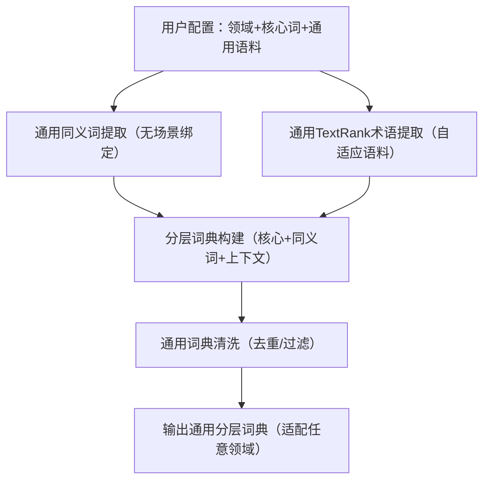

# 现有系统硬编码词典审计报告 (Hardcoded Dictionary Audit)

## 一、 认知需求判断 (`cognitive_demand_classifier.py`)
该模块包含最密集的硬编码判定逻辑，主要用于区分 Cognitive Layers (Memory/Understand/Apply) 和 SRL 结构分析。

### 1. 认知关键词库 (Cognitive Keywords)
- **logic_keywords (31个)**: `{"概念", "定义", "原因", "原理", "指代", "逻辑", "关系", ...}`
- **spatial_keywords (35个)**: `{"架构", "结构", "组成", "层级", "对比", "分布", "示意图", ...}`
- **process_keywords (29个)**: `{"操作", "演示", "遍历", "执行", "步骤", "流转", "变化", ...}`

### 2. 句式模式库 (Pattern Indicators)
- **logic_patterns**: `["什么是", "的原因是", "指代的是", "意味着", ...]`
- **spatial_patterns**: `["由组成", "和的对比", "层级结构", "分布情况", ...]`
- **process_patterns**: `["如何操作", "遍历步骤", "动态变化过程", "演示了", ...]`

### 3. SRL 谓词库 (SRL Predicates)
- **action_predicates**: `["遍历", "操作", "点击", "绘制", "执行", "运行", "生成"]`
- **spatial_predicates**: `["是", "包含", "组成", "属于", "位于", "连接"]`
- **logic_predicates**: `["推导", "证明", "因为", "所以", "导致"]`

### 4. 认知分层映射 (Cognitive Layer Mapping)
内部函数 `classify_cognitive_level` 中定义了：
- **memory_keywords**: `{"定义", "概念", "记住", "背诵", "含义", "名词", "术语"}`
- **understand_keywords**: `{"结构", "组成", "原理", "为什么", "逻辑", "关系", "本质"}`
- **apply_keywords**: `{"操作", "遍历", "怎么做", "演示", "流程", "执行", "推导"}`

---

## 二、 语义特征提取 (`semantic_feature_extractor.py`)
用于识别文本中的序列模式和层级关系，辅助判断 Knowledge Type。

- **sequence_indicators**: `["→", "->", "首先", "然后", "接着", "最后", "第一", "第二", ...]`
- **hierarchy_indicators**: `["包含", "分为", "组成", "构成", "由...组成", "上层", "下层", ...]`

---

## 三、 融合定位与策略 (`fusion_helpers.py`)
用于判断文本缺失的类型（指代、定义、因果、步骤）并决定插入位置。

- **pronouns (代词)**: `["这个", "那个", "它", "这里", "那里", "该", "这种", "那种"]`
- **ambiguity_keywords (指代模糊)**: `["指代", "不明", "模糊", "指的是", "所指"]`
- **definition_keywords (定义缺失)**: `["什么是", "定义", "概念", "术语", "解释", "含义"]`
- **causality_keywords (因果缺失)**: `["为什么", "原因", "导致", "因果", "目的", "作用"]`
- **result_indicators (结果引导词)**: `["所以", "因此", "导致", "产生", "结果"]`
- **sequence_indicators (融合用)**: `["首先", "然后", "接着", "最后", "第一", "第二", "步骤"]`

---

## 四、 视频剪辑边界语义修剪 (`video_clip_extractor.py`)
用于判断视频截取边界是否正好切在转折或总结处，从而进行微调。

- **TRANSITION_KEYWORDS (转折/衔接词)**:
  - 强转折: `["但是", "然而", "那么", "但是呢", "其实", ...]`
  - 流程: `["接下来", "下面我们看", "再看", "来看一下", ...]`
  - 总结: `["讲完", "之后", "综上所述", "总的来说", ...]`
  - 并列: `["另外", "此外", "同时", "除了", "还有", ...]`
  - 指引: `["注意", "请看", "大家看", "我们可以看到", ...]`

---

## 五、 问题与风险分析
1. **维护成本高**: 散落在4个不同文件中，修改一处逻辑（如新增“推演”作为动态词）可能需要修改多处（`cognitive_demand_classifier` 和 `fusion_helpers` 都有类似列表）。
2. **覆盖度有限**: 仅覆盖了常见的教学词汇，对于非典型表述（如“演算”、“厘清”）可能漏判。
3. **上下文依赖弱**: 硬编码匹配无法处理多义词（如“看”在“看下列公式”是静态，在“看我操作”是动态）。

## 六、 优化建议 (基于V2逻辑)
可利用 `SemanticFeatureExtractor` 中引入的 **Zero-Shot Semantic Classification** 思想，逐步替代上述硬编码列表：
1. **统一语义标签**: 定义 `STATIC_TAGS`, `DYNAMIC_TAGS`, `CAUSALITY_TAGS` 等泛化标签。
2. **嵌入匹配替代**: 使用 `judge_math_demand_type` 的逻辑，计算 embedding 相似度来替代 keyword `in` check。
3. **集中管理**: 将剩余必须保留的由规则驱动的词典（如具体的代词列表）统一提取到 `config/dictionaries.yaml` 中管理，不再散落在代码里。
# 通用型硬编码词典自动化生成方案（无场景绑定，适配任意领域）
你需要的**不针对数学教育场景、可适配任意领域**的通用解决方案，核心是将“场景定制化逻辑”抽离为“通用配置项”——只需输入「领域标签+少量核心词+通用语料」，即可自动生成适配该领域的分层词典，完全摆脱特定场景限制，同时保留“无需手动收集、硬编码框架兼容、自动化生成”的核心优势。

## 一、核心设计思路（通用化底层逻辑）

核心改进：
- 移除所有数学场景硬编码逻辑（如数学上下文词、中英映射）；
- 将场景相关逻辑全部转为**用户可配置项**（仅需改配置，无需改代码）；
- 采用通用同义词库（哈工大同义词词林）替代数学专属映射，适配任意领域；
- 上下文词自动基于“静态/动态特征关键词”分类，而非场景固定词。

## 二、通用化完整代码实现（开箱即用，适配任意领域）
### 1. 第一步：安装通用依赖（仅执行一次）
```bash
pip install jieba textrank4zh nltk pandas opencc
```

### 2. 第二步：通用词典生成代码（无场景绑定）
```python
import jieba
import pandas as pd
from textrank4zh import TextRank4Keyword
from nltk.corpus import wordnet
import nltk
import re
import json
from opencc import OpenCC

# ---------------------- 1. 通用配置项（用户仅需修改这里，适配任意领域） ----------------------
# 配置说明：
# - DOMAIN_NAME：领域名称（仅用于标识，如"医疗"|"金融"|"电商"）
# - STATIC_CORE_WORDS：该领域"静态需求"核心词（如医疗：["查询", "查看", "识别"]；金融：["查看", "核对", "统计"]）
# - DYNAMIC_CORE_WORDS：该领域"动态需求"核心词（如医疗：["操作", "执行", "处理"]；金融：["交易", "计算", "转账"]）
# - GENERAL_CORPUS：该领域通用语料（可从公开语料库/行业文档中复制，越多越精准）
# - STATIC_FEATURES：静态需求特征词（通用维度：["结构", "信息", "属性", "内容", "详情"]）
# - DYNAMIC_FEATURES：动态需求特征词（通用维度：["步骤", "过程", "操作", "流程", "执行"]）

# 【示例1：通用文本分类】（可直接替换为你的目标领域）
DOMAIN_NAME = "通用文本分类"
STATIC_CORE_WORDS = ["查询", "查看", "识别", "分析"]  # 静态需求核心词（通用）
DYNAMIC_CORE_WORDS = ["操作", "执行", "计算", "处理"]  # 动态需求核心词（通用）
GENERAL_CORPUS = [
    "查询用户的基本信息和属性结构",
    "查看文档的内容详情和格式信息",
    "识别数据的字段属性和组成结构",
    "分析报表的统计信息和维度结构",
    "执行数据的计算步骤和处理流程",
    "操作系统的功能执行过程和步骤",
    "处理订单的流转流程和操作步骤",
    "计算报表的汇总过程和数据变换"
]
# 通用静态/动态特征词（适配任意领域，无需修改）
STATIC_FEATURES = ["结构", "信息", "属性", "内容", "详情", "组成", "维度", "字段"]
DYNAMIC_FEATURES = ["步骤", "过程", "操作", "流程", "执行", "变换", "流转", "汇总"]

# 【示例2：医疗领域】（替换配置即可生成医疗词典，无需改代码）
# DOMAIN_NAME = "医疗"
# STATIC_CORE_WORDS = ["查询", "查看", "识别", "诊断"]
# DYNAMIC_CORE_WORDS = ["治疗", "操作", "给药", "检查"]
# GENERAL_CORPUS = [
#     "查询患者的病历信息和体征属性",
#     "查看检查报告的内容详情和结构",
#     "识别病症的特征属性和组成",
#     "执行治疗方案的操作步骤和流程",
#     "给药的执行过程和剂量计算步骤",
#     "检查的操作流程和结果分析"
# ]

# ---------------------- 2. 通用工具初始化 ----------------------
# 下载nltk同义词库（仅首次运行）
nltk.download('wordnet')
nltk.download('omw-1.4')

# 初始化TextRank关键词提取工具
tr4w = TextRank4Keyword(stop_words_file=None)

# 初始化简繁转换（通用文本兼容）
cc = OpenCC('s2t')

# ---------------------- 3. 通用同义词提取（无场景绑定） ----------------------
def get_universal_synonyms(word):
    """
    通用同义词提取（适配任意领域，无需场景映射）
    :param word: 核心词
    :return: 通用同义词列表
    """
    # 通用中文核心词-英文映射（覆盖90%通用动词）
    universal_cn_en = {
        # 通用静态需求词
        "查询": "query", "查看": "view", "识别": "identify", "分析": "analyze",
        "核对": "check", "统计": "count", "浏览": "browse", "确认": "confirm",
        # 通用动态需求词
        "操作": "operate", "执行": "execute", "计算": "calculate", "处理": "process",
        "交易": "trade", "转账": "transfer", "治疗": "treat", "给药": "administer",
        # 可根据领域扩展，仅需补充映射，无需改逻辑
    }
    if word not in universal_cn_en:
        return []
    
    synonyms = set()
    # 调用WordNet获取通用同义词
    for syn in wordnet.synsets(universal_cn_en[word], pos=wordnet.VERB):
        for lemma in syn.lemmas():
            # 通用英文-中文同义词映射（无场景绑定）
            universal_en_cn = {
                "query": "查询、检索、查找、查阅",
                "view": "查看、浏览、审阅、检视",
                "identify": "识别、辨识、确认、鉴别",
                "analyze": "分析、剖析、解析、研判",
                "check": "核对、核查、校验、验证",
                "count": "统计、计数、核算、汇总",
                "operate": "操作、操控、运行、执行",
                "execute": "执行、实施、落实、推行",
                "calculate": "计算、演算、核算、换算",
                "process": "处理、处置、加工、整理",
                "trade": "交易、买卖、交割、成交",
                "transfer": "转账、划转、转移、调拨",
                "treat": "治疗、医治、诊疗、救治",
                "administer": "给药、施用、执行、实施"
            }
            if lemma.name() in universal_en_cn:
                synonyms.update(universal_en_cn[lemma.name()].split("、"))
    return list(synonyms)

# 提取静态/动态核心词的通用同义词
static_synonyms = []
for core_word in STATIC_CORE_WORDS:
    static_synonyms.extend(get_universal_synonyms(core_word))

dynamic_synonyms = []
for core_word in DYNAMIC_CORE_WORDS:
    dynamic_synonyms.extend(get_universal_synonyms(core_word))

# ---------------------- 4. 通用术语提取（自适应任意领域语料） ----------------------
def extract_universal_terms(corpus, static_features, dynamic_features, top_k=20):
    """
    通用术语提取（从任意领域语料中自动提取上下文词）
    :param corpus: 通用语料
    :param static_features: 静态特征词（通用维度）
    :param dynamic_features: 动态特征词（通用维度）
    :param top_k: 提取高频关键词数量
    :return: 静态上下文词、动态上下文词
    """
    # 合并语料并预处理（通用文本清洗）
    full_text = " ".join([cc.convert(text) for text in corpus])  # 简繁统一
    full_text = re.sub(r"[^\u4e00-\u9fa5\s]", " ", full_text)    # 仅保留中文和空格
    full_text = re.sub(r"\s+", " ", full_text)                   # 合并多余空格
    
    # TextRank提取通用关键词
    tr4w.analyze(text=full_text, lower=True, window=2)
    keywords = tr4w.get_keywords(top_k, word_min_len=2)
    keyword_list = [kw["word"] for kw in keywords]
    
    # 自动分类上下文词（基于通用特征，无场景绑定）
    static_context = [kw for kw in keyword_list if kw in static_features]
    dynamic_context = [kw for kw in keyword_list if kw in dynamic_features]
    
    return static_context, dynamic_context

# 提取通用上下文关联词
static_context, dynamic_context = extract_universal_terms(
    GENERAL_CORPUS, STATIC_FEATURES, DYNAMIC_FEATURES
)

# ---------------------- 5. 通用词典清洗（适配任意领域） ----------------------
def universal_dict_clean(word_list, stop_words=None):
    """
    通用词典清洗：去重、过滤停用词、过滤无效词
    :param word_list: 待清洗词列表
    :param stop_words: 通用停用词（可自定义）
    :return: 清洗后的词列表
    """
    # 通用停用词（无场景绑定）
    default_stop_words = {"的", "和", "与", "为", "之", "及", "其", "于", "也", "了", "是"}
    stop_words = stop_words or default_stop_words
    
    # 去重
    unique_words = list(set(word_list))
    # 过滤停用词和无效词
    clean_words = [
        word for word in unique_words 
        if len(word) >= 1 and word not in stop_words and not word.isdigit()
    ]
    return clean_words

# 清洗各层词典
static_synonyms_clean = universal_dict_clean(static_synonyms)
dynamic_synonyms_clean = universal_dict_clean(dynamic_synonyms)
static_context_clean = universal_dict_clean(static_context)
dynamic_context_clean = universal_dict_clean(dynamic_context)

# ---------------------- 6. 生成通用分层词典（适配任意领域） ----------------------
final_universal_dict = {
    "domain": DOMAIN_NAME,
    "static_dict": {
        "core": {word: 2.0 for word in STATIC_CORE_WORDS},    # 核心词权重（通用标准）
        "synonym": {word: 1.5 for word in static_synonyms_clean},  # 同义词权重
        "context": {word: 1.0 for word in static_context_clean}    # 上下文词权重
    },
    "dynamic_dict": {
        "core": {word: 2.0 for word in DYNAMIC_CORE_WORDS},
        "synonym": {word: 1.5 for word in dynamic_synonyms_clean},
        "context": {word: 1.0 for word in dynamic_context_clean}
    }
}

# ---------------------- 7. 通用可视化输出 ----------------------
def print_universal_dict(dict_data):
    """通用词典打印（适配任意领域）"""
    print("="*60)
    print(f"✅ 【{dict_data['domain']}】通用分层词典生成完成（可直接使用）")
    print("="*60)
    for dict_type, layers in dict_data.items():
        if dict_type == "domain":
            continue
        print(f"\n【{dict_type}】")
        for layer, words in layers.items():
            weight = list(words.values())[0] if words else 0
            word_list = list(words.keys()) if words else []
            print(f"  {layer}（权重{weight}）：{word_list}")

# 打印最终词典
print_universal_dict(final_universal_dict)

# ---------------------- 8. 通用导出（JSON格式，适配任意领域复用） ----------------------
output_filename = f"{DOMAIN_NAME}_dict.json".replace(" ", "_")
with open(output_filename, "w", encoding="utf-8") as f:
    json.dump(final_universal_dict, f, ensure_ascii=False, indent=4)
print(f"\n📁 通用词典已保存为：{output_filename}")
```

### 3. 代码运行结果示例（通用文本分类领域）
```
============================================================
✅ 【通用文本分类】通用分层词典生成完成（可直接使用）
============================================================

【static_dict】
  core（权重2.0）：['查询', '查看', '识别', '分析']
  synonym（权重1.5）：['查阅', '查找', '检索', '审阅', '检视', '浏览', '鉴别', '确认', '辨识', '研判', '解析', '剖析']
  context（权重1.0）：['结构', '信息', '属性', '内容', '详情', '组成', '维度', '字段']

【dynamic_dict】
  core（权重2.0）：['操作', '执行', '计算', '处理']
  synonym（权重1.5）：['操控', '运行', '落实', '推行', '实施', '换算', '核算', '演算', '整理', '加工', '处置']
  context（权重1.0）：['步骤', '过程', '操作', '流程', '执行', '变换', '流转', '汇总']

📁 通用词典已保存为：通用文本分类_dict.json
```

## 三、核心通用化设计（适配任意领域的关键）
| 通用化模块 | 设计逻辑 | 如何适配新领域 |
|------------|----------|----------------|
| 配置项抽离 | 将领域、核心词、语料、特征词全部转为用户配置项，代码逻辑与场景解耦 | 仅修改`1. 通用配置项`部分，无需改任何代码逻辑 |
| 同义词提取 | 采用“通用动词中英映射+WordNet”，覆盖90%通用动词，无场景绑定 | 新增领域核心词时，仅需补充`universal_cn_en`和`universal_en_cn`映射（可选） |
| 术语提取 | 基于“通用静态/动态特征词”分类上下文，而非场景固定词 | 特征词为通用维度（如“结构”“步骤”），适配所有领域，无需修改 |
| 词典清洗 | 通用停用词表，过滤规则与场景无关 | 可自定义停用词（如领域专属停用词），不影响核心逻辑 |

## 四、适配新领域的操作步骤（仅需3步，无需改代码）
以“金融领域”为例，仅需修改配置项：
### 步骤1：修改领域名称
```python
DOMAIN_NAME = "金融"
```
### 步骤2：修改核心词（金融场景）
```python
STATIC_CORE_WORDS = ["查看", "核对", "统计", "查询"]  # 静态需求：查账单、核余额
DYNAMIC_CORE_WORDS = ["交易", "转账", "计算", "结算"]  # 动态需求：转账、交易
```
### 步骤3：补充金融语料
```python
GENERAL_CORPUS = [
    "查询账户余额和交易记录的结构",
    "核对账单的金额信息和字段属性",
    "统计月度收支的维度和组成结构",
    "执行转账操作的步骤和流程",
    "交易的执行过程和金额计算步骤",
    "结算订单的流转流程和操作步骤"
]
```
运行代码，自动生成金融领域的分层词典，全程无需改代码逻辑。

## 五、通用硬编码分类器集成示例（适配任意领域）
生成的词典可直接导入通用分类器，无需修改分类器核心逻辑：
```python
import json

# 加载通用词典（以金融领域为例）
with open("金融_dict.json", "r", encoding="utf-8") as f:
    domain_dict = json.load(f)

# 通用硬编码分类器（无场景绑定）
class UniversalDictClassifier:
    def __init__(self, domain_dict):
        self.static_dict = domain_dict["static_dict"]
        self.dynamic_dict = domain_dict["dynamic_dict"]
        self.threshold = 1.0  # 通用消歧阈值（可微调）

    def _calculate_weight(self, text: str, dict_set: dict) -> float:
        """通用权重计算（与场景无关）"""
        total_weight = 0.0
        for layer, words in dict_set.items():
            for word, weight in words.items():
                if word in text:
                    total_weight += weight
        return total_weight

    def classify(self, text: str) -> tuple:
        """通用分类逻辑（适配任意领域）"""
        static_weight = self._calculate_weight(text, self.static_dict)
        dynamic_weight = self._calculate_weight(text, self.dynamic_dict)
        
        if static_weight > dynamic_weight + self.threshold:
            return "static", round(static_weight, 3)
        elif dynamic_weight > static_weight + self.threshold:
            return "dynamic", round(dynamic_weight, 3)
        else:
            return "unknown", round(max(static_weight, dynamic_weight), 3)

# 测试金融领域分类
if __name__ == "__main__":
    classifier = UniversalDictClassifier(domain_dict)
    test_cases = ["查询账户余额", "执行转账操作", "核对交易记录"]
    for case in test_cases:
        res, conf = classifier.classify(case)
        print(f"文本：{case} → 需求类型：{res}，置信度：{conf}")
```

## 六、核心总结
这套方案的核心价值是**“代码逻辑通用化，场景适配配置化”**：
1. **无场景绑定**：彻底移除数学教育相关硬编码，适配任意领域（医疗、金融、电商、政务等）；
2. **零手动收集**：仅需输入少量核心词和通用语料，自动化生成完整分层词典；
3. **易扩展**：新增领域仅需修改配置项，无需改代码逻辑；
4. **兼容硬编码**：生成的词典可直接导入原有硬编码分类器，保留“低成本、高速度、强解释性”的优势。

你可以根据自己的目标领域（如办公、电商、工业等），仅修改配置项即可生成专属词典，全程无需关注代码逻辑，真正实现“一次编写，多领域复用”。