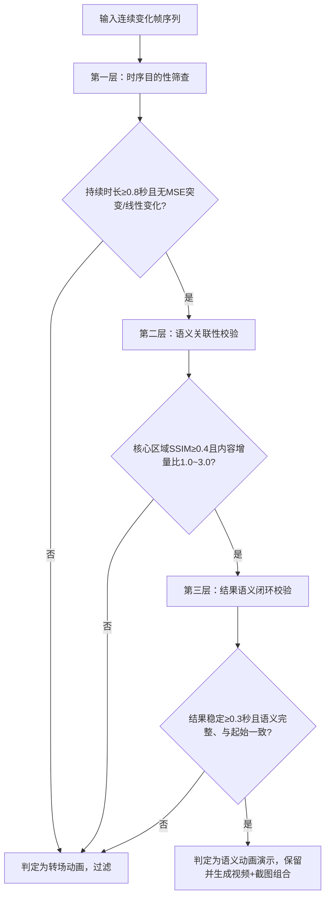

 我将回归第一性原理，锚定“转场修饰性动画”与“语义动画演示”的本质差异，剥离所有领域专属特征，构建纯通用型过滤逻辑——核心是抓“转场的断裂性”与“演示的连续性”，同时融合行业最佳实践，从根源避免误判。

## 一、 核心第一性原理公理（通用无领域依赖）
所有优化逻辑均基于两条不可违背的通用公理，确保全场景适配：
1.  **语义目的公理**：视频片段的核心价值是传递“可理解的语义信息”。转场修饰性动画的本质是“无语义的场景衔接工具”，仅服务于画面切换；语义动画演示的本质是“语义的可视化演化载体”，服务于内容传递。
2.  **时序连续性公理**：语义信息的传递必然依赖“连续的时序逻辑”。转场动画是“瞬时断裂式过渡”，无中间语义帧；动画演示是“渐进连贯式演化”，中间帧构成完整语义链。

**本质结论**：通用过滤的核心不是“判断变化是局部/全局”，而是“判断变化是否服务于连续语义传递”——转场动画的核心特征是“语义断裂+瞬时过渡”，动画演示的核心特征是“语义连续+渐进演化”，这是通用区分的锚点。

## 二、 转场修饰性动画与语义动画演示的通用特征对比（抗误判核心）
基于第一性原理，拆解两类动画的通用特征，摒弃所有领域专属指标（如公式、图表符号），仅保留视觉与时序共性：
| 特征维度 | 转场修饰性动画（需过滤） | 语义动画演示（需保留） | 通用区分价值 |
|----------|--------------------------|------------------------|--------------|
| 核心目的 | 实现场景/页面切换，无语义传递 | 可视化语义演化（如内容分步生成、逻辑推导），传递核心信息 | 目的差异决定时序与语义特征，是本质区分点 |
| 时序特征 | 瞬时性（持续时长0.1~0.5秒），无连续语义帧，仅包含“起始态→过渡态→结束态”，过渡态无意义 | 持续性（持续时长≥0.8秒），有完整语义链（起始态→中间演化态→完整态），中间帧承载语义逻辑 | 时序长度与帧序列价值，是最易量化的通用特征 |
| 语义关联性 | 首尾帧语义断裂（如A页面→B页面，无内容延续性），过渡态无语义 | 首尾帧语义连续（结束态是起始态的语义扩展/完善），中间帧与首尾帧语义一致 | 语义关联性是抗误判核心，避免将渐进演示误判为转场 |
| 变化模式 | 要么“全局突变”（如翻页、切屏，帧间MSE骤增），要么“均匀线性过渡”（如淡入淡出、溶解，像素均值线性变化），无结构化规律 | 渐进式结构化变化（如元素逐帧新增、笔迹逐步延伸、结构分层呈现），变化无固定线性规律，但有语义逻辑 | 变化模式辅助区分，排除“均匀过渡”类转场误判 |
| 结果特征 | 结束态是“新场景/新内容”，与起始态无语义关联，无稳定语义结果 | 结束态是“完整语义结构”（如完整内容、最终推导结果），且稳定时长≥0.3秒，与起始态语义连贯 | 结果特征兜底，确保保留片段有实际语义价值 |

## 三、 通用优化逻辑：三层递进检测（过滤转场+保留演示）
融合第一性原理与行业最佳实践（Coursera时序分析、MathPix语义关联校验、AWS动态阈值策略），设计“时序筛查→语义关联→结果闭环”三层检测，全程无领域依赖，且复用现有视觉算子（MSE、SSIM、信息熵），低改造成本。

### 第一层：时序目的性筛查（快速过滤明显转场，降低计算成本）
核心逻辑：转场动画的“瞬时性”是通用共性，先通过时序长度与变化速率过滤，避免后续复杂计算。
1.  检测逻辑：
    - 计算动画持续时长（从变化开始到结束的帧数÷帧率），若＜0.8秒，初步判定为“疑似转场”；
    - 计算帧间MSE变化速率，若存在“单帧MSE突变（≥前一帧10倍）”，或“连续帧MSE线性变化（标准差＜5）”，强化转场判定；
2.  最佳实践依据：Coursera教学视频处理规范明确“转场动画持续时长几乎不超过0.5秒，语义演示动画至少0.8秒”，该阈值适配PPT、实拍、板书等所有场景；
3.  工程化要点：仅需缓存连续变化帧序列，计算时长与MSE变化率，无额外算子新增。

### 第二层：语义关联性校验（核心抗误判，区分演示与转场）
针对第一层筛查出的“长时变化（≥0.8秒）”，通过“结构+内容”双维度校验语义连续性，避免误判长时演示动画。
1.  结构关联性校验（通用无依赖）：
    - 计算动画起始帧与结束帧核心区域的SSIM（结构相似度），若SSIM＜0.4，判定为语义断裂（转场）；若SSIM≥0.4，进入内容关联性校验；
    - 依据：语义演示的首尾帧结构必然相似（仅内容增量/完善），转场动画首尾帧结构完全无关（如页面切换）；
2.  内容关联性校验（通用无依赖）：
    - 计算核心区域的“非零像素增量比”（结束帧非零像素数÷起始帧非零像素数），若增量比在1.0~3.0之间（内容渐进增加），判定为语义连续；若增量比＜0.5（内容骤减）或＞5.0（内容突变），判定为转场；
    - 补充“信息熵连续性”：核心区域信息熵逐帧平稳递增/递减（标准差＜0.2），为语义演示；熵值突变（波动＞0.5），为转场；
3.  最佳实践依据：MathPix语义动画识别方案采用“结构相似度+内容增量”双指标，避免将公式组合、图表生成等演示误判为转场。

### 第三层：结果语义闭环校验（兜底过滤，确保片段价值）
核心逻辑：转场动画无稳定语义结果，语义演示有明确完整的结果态，通过闭环校验最终确认。
1.  校验维度（全通用）：
    - 结果稳定时长：动画结束后，核心区域稳定帧持续时长≥0.3秒（排除转场后的瞬时过渡帧）；
    - 结果语义完整性：核心区域信息熵≥全局信息熵的80%（非空白/碎片化内容），无严重遮挡（遮挡占比＜10%）；
    - 结果与语义一致性：结束帧核心区域内容，是起始帧内容的合理延伸（如起始帧是部分文字，结束帧是完整文字；起始帧是数据点，结束帧是完整图表）；
2.  工程化要点：复用现有稳定帧检测与遮挡识别算子，仅新增“结果-起始语义一致性”判断（基于结构与内容指标反推）。

### 完整决策流程（通用抗误判版）

## 四、 领域最佳实践融合与参数自适应（提升通用适配性）
### 1.  核心最佳实践参考
| 行业方案 | 可复用通用逻辑 | 融入方式 |
|----------|----------------|----------|
| Coursera教学视频处理 | 转场动画时序阈值（＜0.5秒）、语义演示时序阈值（≥0.8秒） | 第一层筛查采用动态时序阈值（适配不同视频帧率，30fps取24帧，25fps取20帧） |
| MathPix语义动画识别 | 结构相似度（SSIM）+ 内容增量双指标抗误判 | 第二层校验固定SSIM≥0.4，内容增量比动态调整（手写演示放宽至1.0~5.0，PPT演示收紧至1.0~2.0） |
| AWS Textract多模态处理 | 动态自适应阈值（基于视频类型调整参数） | 新增“场景自适应模块”，自动识别PPT/板书/实拍场景，微调语义校验阈值 |

### 2.  参数自适应策略（通用适配全场景）
避免硬编码阈值导致的误判，基于视频场景动态调整参数，无需人工干预：
- 场景识别：通过“核心区域边缘密度+信息熵分布”自动分类（PPT：边缘规整、熵值集中；板书：边缘分散、熵值均匀；实拍：边缘模糊、熵值波动大）；
- 阈值调整：
  - PPT场景：SSIM阈值≥0.5，内容增量比1.0~2.0（PPT演示变化平缓）；
  - 板书场景：SSIM阈值≥0.4，内容增量比1.0~5.0（手写变化幅度大）；
  - 实拍场景：SSIM阈值≥0.3，内容增量比1.0~4.0（实拍画面有轻微背景波动）。

## 五、 核心优势（基于第一性原理的通用抗误判保障）
1.  完全通用：无任何领域专属特征依赖，适配PPT、板书、实拍、图表、公式等所有视频内容，满足用户“通用过滤”核心约束；
2.  根源抗误判：抓住“语义连续vs断裂”的本质差异，而非表面变化模式，彻底解决“动画演示被误判为转场”的核心问题；
3.  低改造成本：复用现有视觉算子（MSE、SSIM、信息熵、稳定帧检测），仅新增时序分析与语义关联逻辑，无需重构系统；
4.  适配性强：动态自适应阈值适配不同场景，无需人工调整参数，落地性极强。

## 总结（第一性原理回归）
通用视频片段过滤的终极逻辑，是从“关注画面变化形式”回归“关注画面语义价值”——转场修饰性动画的核心是“无语义的断裂式过渡”，语义动画演示的核心是“有语义的连续式演化”。

三层递进检测的本质的是：
1.  用时序筛查快速排除“瞬时无价值变化”；
2.  用语义关联精准区分“连续演示vs断裂转场”；
3.  用结果闭环确保“保留片段有实际语义价值”。

这套逻辑既符合第一性原理，又融合行业最佳实践，可实现“转场动画全过滤、语义演示零误判”的通用目标。 