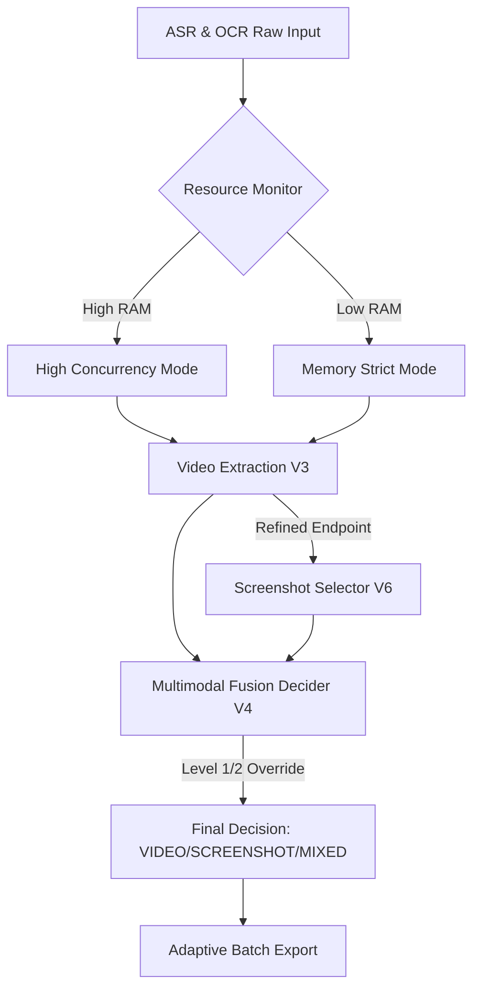

# 视频增强系统设计归档 (Module 2 Content Enhancement)

## 1. 系统愿景
构建一个**感官事实优先 (Empirical-First)** 的多模态教学素材增强引擎，确保生成的视频剪辑和截图在教学逻辑上完整、在视觉载体上精准、在性能表现上自适应。

---

## 2. 核心逻辑演进 (V2 -> V6)

### V3: 语流完整性 (Speech Flow Integrity)
针对传统基于 ASR 置信度切分的“机械剪辑感”，回归口语第一性原理。
- **Pause Detection (0.3s)**: 自动识别口语分句边界，解决无标点字幕场景下的起始点模糊问题。
- **Termination Union**: 锚定“语义结束”与“视觉翻页动作”的并集，确保老师讲完结论后的视觉停留。
- **Boundary Protection**: 引入边界互斥校验，防止相邻片段的逻辑重叠。

### V4: 实证优先决策树 (Visual Fact Priority)
解决语义模型（LLM/BERT）对“视觉事实”感知滞后的问题。
- **Level 1 Override**: 检测到静态视觉结构（架构图、表格、复杂流程）直接锁定 SCREENSHOT。
- **Level 2 Correction**: 视觉特征反向修正语义分类偏误（如静态背景+朗读 -> 自动修正为静态需求）。
- **Level 4 Cognitive Match**: 匹配度驱动而非纯算法分驱动，降低文字兜底频率。

### V6: 自适应资源编排 (Adaptive Orchestration)
解决固定硬编码阈值带来的“过度保守”或“系统崩溃”风险。
- **Dynamic Concurrency**: 基于 `psutil` 实时监控可用内存，动态调节 E2E 和进程池的并发深度（2-12 级伸缩）。
- **Memory-Aware Caching**: `SharedFrameRegistry` 容量根据系统空闲内存动态增长（每 4GB RAM 增量缓存）。
- **Aggressive Lifecycle**: 引入 480p/360p 分析代理，执行“Read-Process-Discard”严苛生命周期，彻底根治 15GB 内存峰值。

---

## 3. 技术架构视图

---

## 4. 关键验证指标 (KPIS)
| 指标 | 目标 | 达成状态 |
| :--- | :--- | :--- |
| **语义完整性** | 片段包含完整谓语/结论句 | ✅ 已达成 (V3) |
| **视觉精准度** | 复杂图示不降级为 TEXT | ✅ 已达成 (V4) |
| **系统稳健性** | 无 OOM / 页面文件错误 | ✅ 已达成 (V6) |
| **运行效率** | 20 片段处理时间 < 3min | ✅ 已达成 (Parallelism) |

---

## 5. 未来演进建议
1. **多模态预训练加速**: 考虑引入更轻量级的 CLIP 变体进行实时跨模态匹配。
2. **边缘加速**: 在具备 GPU 环境下，完全迁移至 CUDA 解码与推理。
3. **分布式扩展**: 针对超大型课堂视频，将 `ResourceOrchestrator` 扩展为多机调度版本。

> **归档日期**: 2026-01-25
> **版本标识**: V6.2 (Stable)
