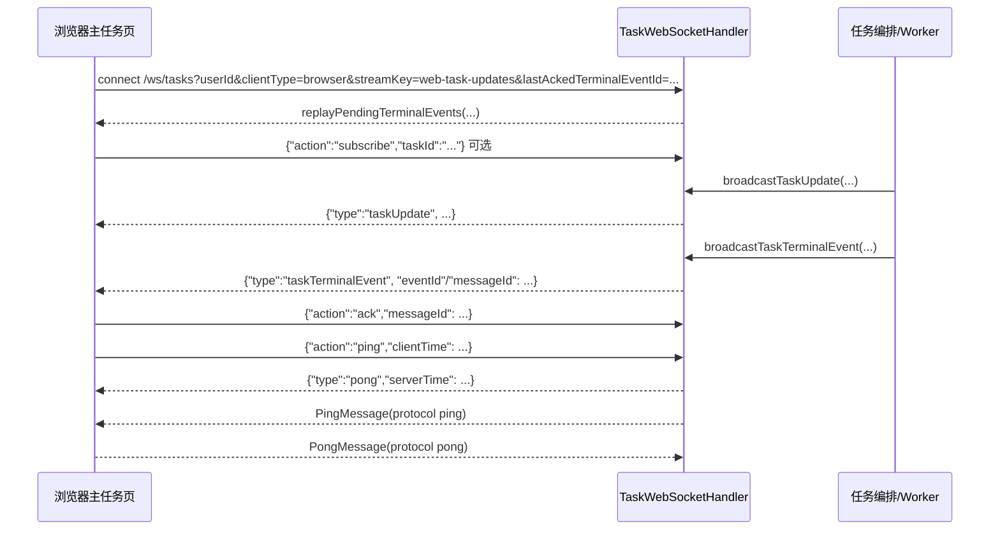

# WebSocket 交互架构

更新日期：2026-03-17  
范围：`D:/videoToMarkdownTest2`

## 1. 文档目的
- 本文记录仓库当前已经落地的 WebSocket 实际交互链路，而不是理想化设计。
- 目标是回答三个问题：
  - 当前有哪些客户端在连接 `/ws/tasks`。
  - 前后端分别发送哪些消息、何时订阅、何时回放。
  - 当前连接保活、半开连接回收、慢连接隔离分别由哪一层负责。

## 2. 总入口
- 后端只注册了一个 WebSocket 入口：`/ws/tasks`。
- 注册位置：`services/java-orchestrator/src/main/java/com/mvp/module2/fusion/websocket/WebSocketConfig.java`
- 所有任务状态推送、任务终态事件回放、phase2b 进度流都复用这个入口。

## 3. 当前存在的三条实时链路

### 3.1 浏览器主任务状态流
- 前端文件：`services/java-orchestrator/src/main/resources/static/index.html`
- 用途：
  - 任务列表实时更新
  - 当前任务详情实时更新
  - 终态事件通知与 ack/replay
  - 任务探测结果、去重结果、元数据同步

### 3.2 浏览器 Phase2B 流
- 前端文件：`services/java-orchestrator/src/main/resources/static/lib/mobile-anchor-panel.js`
- 用途：
  - phase2b 进度文本
  - phase2b markdown chunk 流
  - phase2b markdown 最终结果

### 3.3 Android 实时客户端流
- 前端文件：`app/src/main/java/com/hongxu/videoToMarkdownTest2/ReliableTaskWebSocketClient.kt`
- 用途：
  - Android 端可靠任务状态同步
  - 应用层心跳、断线重连、消息游标去重与 ack

## 4. 后端统一处理器

### 4.1 统一入口与运行态
- 处理器：`services/java-orchestrator/src/main/java/com/mvp/module2/fusion/websocket/TaskWebSocketHandler.java`
- 心跳协调器：`services/java-orchestrator/src/main/java/com/mvp/module2/fusion/websocket/TaskWebSocketHeartbeatCoordinator.java`
- 连接建立入口：`afterConnectionEstablished(...)`
- 连接关闭入口：`afterConnectionClosed(...)`
- 传输异常入口：`handleTransportError(...)`
- 文本消息入口：`handleTextMessage(...)`
- 协议层 Pong 入口：`handlePongMessage(...)`
- 当前职责拆分：
  - `TaskWebSocketHandler`
    - 协议解析、订阅管理、ack/replay、广播发送
  - `TaskWebSocketHeartbeatCoordinator`
    - 会话运行态、时间轮调度、transport/application heartbeat、`suspended` 判定

### 4.2 会话注册与订阅桶
- 后端内部维护四类会话/订阅表：
  - `userSessions`
    - 以 `userId` 为键，表示该用户的所有在线连接。
    - 任务所有者即使没有显式订阅具体 `taskId`，也会通过这一层收到自己的任务更新。
  - `taskSubscribers`
    - 以 `taskId` 为键，表示订阅某个具体任务的连接。
  - `collectionSubscribers`
    - 以 `collectionId` 为键，表示订阅某个合集任务列表的连接。
  - `phase2bSubscribers`
    - 以 `channel` 为键，表示订阅 phase2b 流式输出的连接。

### 4.3 托管会话与发送背压隔离
- 当前实现不会再把原始 `WebSocketSession` 直接放进广播链路。
- 在连接建立时，后端会把 session 包装为 `ConcurrentWebSocketSessionDecorator`。
- 包装目的：
  - 给单连接发送增加时间上限与缓冲上限。
  - 避免单个慢浏览器连接拖慢整条业务推送链。
- 2026-03-18 起，后端会把“发送线程已经收到中断信号”与“真正的连接发送失败”分开处理：
  - 如果 watchdog/gRPC 监控线程在停止过程中触发了 `InterruptedException`，`sendRawMessage(...)` 只跳过本次消息并恢复线程中断标记，不再把它升级成会话发送故障。
  - 只有非中断类的发送异常，才会继续按 `closeSessionSilently(..., 4001)` 关闭会话。
- 相关代码点：
  - `wrapSessionForConcurrentSend(...)`
  - `resolveManagedSession(...)`
  - `sendRawMessage(...)`

## 5. 浏览器主任务状态流

### 5.1 建连时机
- 页面初始化时调用 `ensureTaskUpdatesWebSocketConnected()` 建连。
- 页面从后台恢复到前台时，`visibilitychange` 会再次触发连接检查。
- 页面进入 `pageshow` 时，也会再次触发连接检查。
- 页面卸载前通过 `beforeunload` 主动关闭连接。

### 5.2 建连 URL 参数
- 主任务页会自动拼出如下 query 参数：
  - `userId`
  - `clientType=browser`
  - `streamKey=web-task-updates`
  - `lastAckedTerminalEventId`
- 设计意图：
  - `userId` 用于归属用户会话。
  - `clientType=browser` 用于启用浏览器协议层 transport heartbeat。
  - `streamKey=web-task-updates` 用于标识主任务状态流。
  - `lastAckedTerminalEventId` 用于终态事件回放。

### 5.3 浏览器主任务流发给后端的 action
- `subscribe`
  - 显式订阅某个 `taskId`。
- `unsubscribe`
  - 取消订阅某个 `taskId`。
- `subscribeCollection`
  - 订阅某个 `collectionId`。
- `unsubscribeCollection`
  - 取消订阅某个 `collectionId`。
- `cancel`
  - 请求取消任务。
- `ping`
  - 应用层心跳。
- `ack`
  - 对终态事件进行确认。

### 5.4 后端发给浏览器主任务流的消息
- `taskUpdate`
  - 任务状态、进度、状态消息、结果路径、恢复字段、分类字段、成本字段等主消息。
- `taskTerminalEvent`
  - 终态事件队列消息，可 ack/replay。
- `taskProbeResult`
  - 探测结果推送。
- `taskDeduped`
  - 去重命中推送。
- `taskMetaSync`
  - 任务元数据同步推送。
- `pong`
  - 后端对应用层 `ping` 的应答。
- `cancelResult`
  - 对取消任务请求的即时响应。

### 5.5 浏览器主任务流的消息处理
- `index.html` 当前会处理这些 `type`：
  - `pong`
  - `ackConfirmed`
  - `taskUpdate`
  - `taskTerminalEvent`
  - `taskProbeResult`
  - `taskDeduped`
  - `taskMetaSync`
- 终态事件处理完成后，前端会取出 `eventId/messageId` 并调用 `acknowledgeTaskUpdatesSocketMessage(...)` 回发 `ack`。
- 当前终态 ack 采用两阶段语义：
  - 第一阶段：前端只记录待确认 `pendingAckMessageId` 并发送 `ack`
  - 第二阶段：后端持久化 ack 后回发 `ackConfirmed`，前端收到后才推进本地 `lastAckedTerminalEventId`
- 如果连接在第一阶段和第二阶段之间断开，前端会在重连成功后自动重发未确认 ack。

### 5.6 终态事件回放
- 浏览器建连时会带 `lastAckedTerminalEventId`。
- 后端在连接建立时识别：
  - `streamKey=web-task-updates`
  - 且存在用户会话
- 然后调用 `replayPendingTerminalEvents(...)` 把尚未确认的终态事件补发给新连接。
- 当前 `lastAckedTerminalEventId` 只表示“服务器已确认的 ack 游标”，不再在重连时被服务端解释为删除动作。
- 这意味着当前系统的终态事件不是“纯实时即丢失”，而是支持断线后补偿。
- 浏览器在 replay 后再执行任务列表 REST 对账时，会继续复用 `mergeTaskRecordSnapshot(...)` 保住本地 `completed` 状态，避免旧快照把终态重新回退成 `processing/queued`。

## 6. 浏览器 Phase2B 流

### 6.1 建连与订阅
- `mobile-anchor-panel.js` 会单独对 `/ws/tasks` 发起一条连接。
- 建连成功后发送：
  - `{"action":"subscribePhase2b","channel":...}`
- 页面关闭前发送：
  - `{"action":"unsubscribePhase2b","channel":...}`

### 6.2 Phase2B 消息类型
- 后端广播的消息包括：
  - `phase2bProgress`
  - `phase2bMarkdownChunk`
  - `phase2bMarkdownFinal`

### 6.3 当前可靠性特点
- 这条链路和主任务状态流共用同一个后端入口，但前端策略不同。
- 当前 phase2b 浏览器流没有像主任务状态流那样完整的：
  - ack/replay
  - 应用层心跳
  - 前后台恢复自愈
- 2026-03-19 起，phase2b 浏览器流会在建连 URL 上显式带 `clientType=browser`：
  - 这样它会接入服务端同一套协议层 transport heartbeat
  - 但它仍没有主任务流那套应用层判死与终态补偿
- 它更接近“临时流式通道”，而不是具备终态补偿语义的可靠状态流。

## 7. Android 实时客户端流

### 7.1 客户端职责
- Android 使用 `ReliableTaskWebSocketClient` 管理连接。
- 它承担：
  - 建连
  - 应用层心跳
  - 重连退避
  - 消息游标持久化
  - 去重
  - ack

### 7.2 Android 侧关键语义
- 建连 URL 里会带：
  - `userId`
  - `streamKey`
  - `lastReceivedMessageId`
- Android 在收到消息后会：
  - 先识别是否为 `pong`
  - 再读取 `messageId/message_id`
  - 用本地游标窗口做去重
  - 成功处理后回发 `ack`

### 7.3 与浏览器主任务流的区别
- Android 的可靠性逻辑更多地收敛在客户端实现里。
- 浏览器主任务流则把：
  - 终态事件回放
  - 页面生命周期恢复
  - 前端应用层判死
  - 服务端协议层 ping
 组合在一起实现。

## 8. 心跳、探活与连接回收

### 8.1 前端应用层心跳
- 浏览器主任务状态流当前会发送应用层 `ping`。
- 后端收到 `action=ping` 后，回发：
  - `type=pong`
  - `serverTime`
  - `clientTime`
- 这层心跳的职责是：
  - 前端识别“表面 OPEN 但已失活”的连接。
  - 前端在前台恢复时触发自愈与重连。

### 8.2 后端协议层 Ping/Pong
- 后端对 `clientType=browser` 的连接启用协议层 transport heartbeat。
- 实现方式：
  - 连接建立时把会话包装进 `SessionRuntimeState`
  - 用单个 `HashedWheelTimer` 为每个连接投递唯一的心跳检查任务
  - 每次任务触发时：
    - 先根据最近一次 `Pong` 或客户端消息计算空闲时长
    - 未超时则发送 `PingMessage`
    - 超时则直接关闭连接并停止重投递
  - `handlePongMessage(...)` 只更新最近一次 transport `Pong` 时间戳，不再走全量扫描收口
- 当前参数：
  - `tickDuration = 100ms`
  - `ticksPerWheel = 512`
  - transport heartbeat 周期 `20s`
  - transport timeout `60s`
- 这层心跳的职责是：
  - 发现 TCP 半开连接
  - 发现浏览器网络栈级别的失活
  - 及时回收占用的服务器资源

### 8.3 半开连接回收
- 浏览器连接：
  - 以最近一次协议层 `Pong` 或客户端消息作为基线。
  - `60s` 内没有 transport 信号时主动关闭连接。
  - 如果是 `streamKey=web-task-updates`，还会额外追踪应用层活动时间：
    - `60s` 未收到浏览器应用层 `ping/ack/subscribe/...` 等文本信号，则把该会话标记为 `suspended`
    - `suspended` 会话不再接收非终态 `taskUpdate`
    - 终态事件、ack/replay 与 transport heartbeat 保持可用
- 非浏览器连接：
  - 以应用层文本活动作为基线。
  - `35s` 超时后主动关闭连接。

### 8.4 当前分层职责
- 协议层 `ping/pong`
  - 负责链路活性与资源回收。
- 应用层 `ping/pong`
  - 负责前端自愈、假活跃识别与快速重连。
  - 服务端也会基于它把后台浏览器会话切换到 `suspended`，减少高频 processing 推送。
- 终态事件 `ack/replay`
  - 负责可靠补偿，不依赖连接必须持续不断。

## 9. 后端广播来源

### 9.1 主任务状态广播
- `broadcastTaskUpdate(TaskEntry task)`
- `broadcastTaskUpdate(taskId, status, progress, message, resultPath)`

### 9.2 终态事件广播
- `broadcastTaskTerminalEvent(TaskEntry task)`
- 终态事件进入 `TaskTerminalEventService` 队列后再投递。

### 9.3 辅助消息广播
- `broadcastTaskProbeResult(...)`
- `broadcastTaskDeduped(...)`
- `broadcastTaskMetaSync(...)`

### 9.4 Phase2B 广播
- `broadcastPhase2bProgress(...)`
- `broadcastPhase2bMarkdownChunk(...)`
- `broadcastPhase2bMarkdownFinal(...)`

## 10. 当前交互时序

## 11. 现状总结
- 当前系统不是单一一条 WebSocket 链，而是：
  - 一条浏览器主任务状态流
  - 一条浏览器 phase2b 流
  - 一条 Android 可靠客户端流
- 三者共用同一个后端入口 `/ws/tasks`，但前端策略不同。
- 当前可靠性最强的是浏览器主任务状态流，因为它已经具备：
  - 用户级推送
  - 任务级订阅
  - 应用层心跳
  - 协议层 transport heartbeat
  - 终态事件 ack/replay
  - 前后台恢复重连
- 当前可靠性最弱的是浏览器 phase2b 流，因为它仍更接近临时流式通道。
- 但 2026-03-19 起，它至少已经接入浏览器 transport heartbeat，不再完全裸连。
