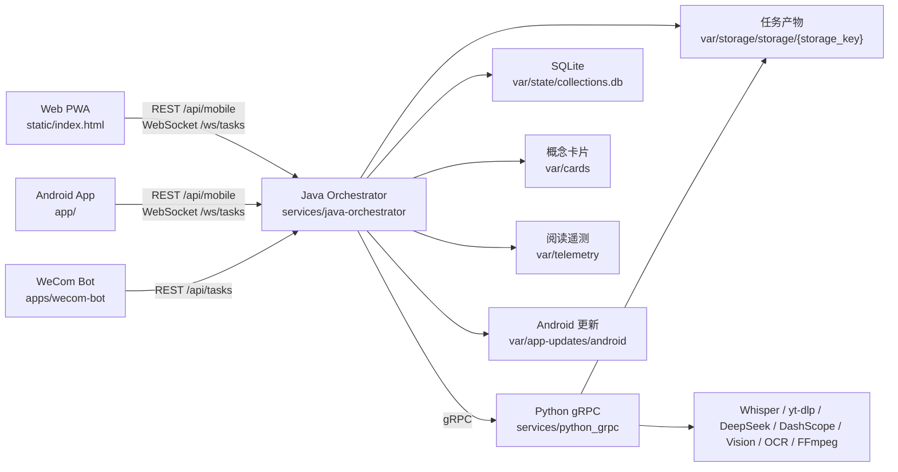
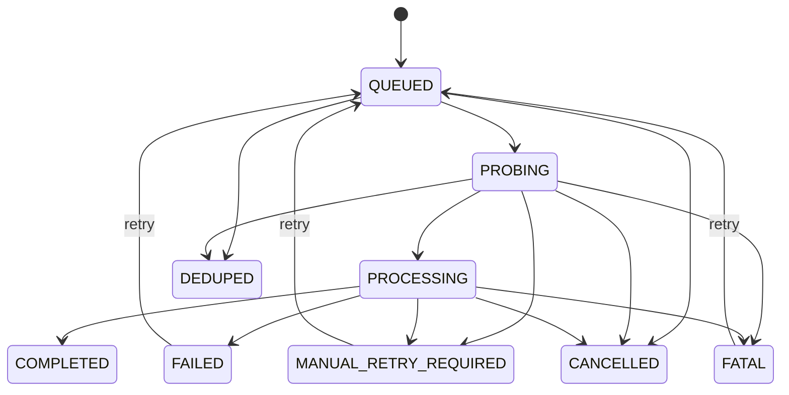

# 系统架构概览

更新日期：2026-03-14  
范围：`D:/videoToMarkdownTest2`

## 1. 系统定位
- 目标：把远端视频、本地视频、书籍文件和文章链接转换为可阅读、可编辑、可归档的 Markdown/JSON 知识产物，并沉淀截图、视频片段、分类、卡片与阅读遥测。
- 核心输入：
  - 远端链接或分享文本：视频 URL、BV、短链、文章链接。
  - 本地输入：浏览器上传文件、本地视频路径、本地书籍文件（`pdf`、`epub`、`txt`、`md`）。
  - 可选控制信息：任务优先级、输出目录、书籍章节/小节范围、合集信息、移动端上下文。
- 核心输出：
  - 任务状态与进度。
  - 结构化文档：`enhanced_output.md`、`result.json`、`video_meta.json`。
  - 素材与中间产物：`assets/`、`intermediates/`、语义单元、任务指标。
  - 辅助资产：分类汇总、概念卡片、阅读遥测、Android 更新清单。
- 职责边界：
  - Java 编排层负责控制平面：受理、持久化状态机、去重、探测、跨阶段编排、实时推送、移动端接口、卡片/分类/更新/遥测聚合。
  - Python gRPC 层负责计算平面：下载、转录、Stage1、Phase2A/2B、视觉链路、提示词加载、模型调用与进程级资源管理。
  - Web PWA 与 Android App 共享同一组 `/api/mobile` 与 `/ws/tasks` 能力。
  - 企业微信机器人是可选外部入口，不属于默认 Docker 启动必需组件。

## 2. 高层拓扑

## 3. 核心组件分层
### 3.1 Java 编排层
- 路径：`services/java-orchestrator/`
- 主要职责：
  - `controller/VideoProcessingController`：通用任务提交、上传、查询、取消、健康检查。
  - `controller/MobileMarkdownController`：移动端任务列表、增量变更、Markdown 读写、资源读取、锚点挂载/同步、导出、上传分片、任务遥测。
  - `controller/MobileCardController`：概念卡片、候选标题、AI 建议、Phase2B 结构化阅读辅助。
  - `controller/MobileAppUpdateController`：Android 版本检查、APK 下载、发布与回滚。
  - `controller/TelemetryIngestController`：移动端阅读遥测分流到冷数据与逻辑池。
  - `queue/TaskQueueManager`：优先级队列、任务状态机、受理持久化、重启恢复。
  - `worker/TaskProcessingWorker`：消费任务、归一化、去重、探测、并发信号量、watchdog 管理。
  - `service/VideoProcessingOrchestrator`：跨阶段编排与 Java 侧素材工程化执行。
  - `service/StorageTaskCacheService`：扫描并缓存 `var/storage/storage` 历史任务。
  - `service/StorageTaskCategoryService`：书籍和历史任务分类补录，写回统一分类事实源。
  - `service/CategoryClassificationResultsRepository`：统一读写 `var/storage/category_classification_results.json`。
  - `websocket/TaskWebSocketHandler`：任务、合集、Phase2B 三类实时通道。
- 前端托管：
  - `src/main/resources/static/index.html` 是唯一静态主入口。
  - `WebConfig` 将历史入口 `/mobile-markdown.html` 永久重定向到 `/index.html`。

### 3.2 Python gRPC 计算层
- 路径：`services/python_grpc/src/`
- 主要职责：
  - `server/`：gRPC 启动、依赖预检、协议实现、运行时环境修补。
  - `server/grpc_service_impl.py`：`VideoProcessingService` 主实现，暴露下载、转录、Stage1、Phase2A、VL、组装等 RPC。
  - `media_engine/knowledge_engine/`：下载与转录底座。
  - `transcript_pipeline/`：Stage1 文本预处理与中间结果产出。
  - `content_pipeline/phase2a/`：语义分割、素材请求规划、VL 材料生成、截图路由、知识分类前置能力。
  - `content_pipeline/phase2b/`：富文本组装与视频分类收尾。
  - `content_pipeline/infra/`：提示词注册与加载、LLM 网关、运行时资源管理、缓存指标。
  - `vision_validation/` 与 `worker/`：CV 批处理 worker、共享内存与多进程运行时。

### 3.3 客户端与边缘入口
- `app/`：Android 客户端，包含语义块阅读器、合集 UI、可靠 WebSocket 客户端、前台提交服务、自动更新管理。
- `apps/grpc-server/main.py`：Python gRPC 标准启动入口。
- `apps/wecom-bot/main.py` + `services/python_grpc/src/apps/bot/wecom_bot.py`：企业微信回调机器人，负责消息入口、任务投递与状态回传。
- `contracts/proto/video_processing.proto`：Java/Python 之间的单一协议真源。

## 4. 运行态数据与事实源
### 4.1 控制平面
- SQLite：`var/state/collections.db`
- Redis：`docker-compose.yml` 中的 `redis` 服务，本地 `run_server.ps1` 默认会自动拉起；只承担运行态热镜像，不是断点恢复的真源。
- 主要表：
  - `task_runtime_state`：任务状态机快照，包含 `task_id`、`status`、`progress`、`probe_payload_json`、`recovery_payload_json`、`book_options_json`、结果路径等。
  - `video_collections`、`collection_episodes`：合集与分集绑定。
  - `task_manual_collection_bindings`：人工归档合集绑定。
  - `file_metadata`、`file_probe_cache`：上传复用与探测缓存。

### 4.2 内容平面
- 任务主存储目录：`var/storage/storage/{storage_key}/`
- `storage_key` 生成方式：
  - 普通视频/本地文件：优先使用归一化输入的 MD5。
  - 书籍 leaf：可使用显式 `storageKey`，确保同一本书的叶子节点可稳定复用目录。
- 典型内容：
  - `enhanced_output.md`
  - `result.json`
  - `video_meta.json`
  - `assets/`
  - `intermediates/task_metrics_latest.json`

### 4.3 统一汇总资产
- 分类事实源：`var/storage/category_classification_results.json`
  - 视频主链由 Python `phase2b/video_category_service.py` 在 Phase2B 末尾写入。
  - 书籍任务与历史缺分类任务由 Java `StorageTaskCategoryService` 补录到同一文件。
- 概念卡片：`var/cards`
- 阅读遥测：`var/telemetry/*.ndjson`
- Android 更新：`var/app-updates/android/`
- 上传缓冲：`var/uploads/`

## 5. 任务控制平面
### 5.1 状态机

### 5.2 控制原则
- 提交成功等价于“已 durable accept”：
  - `TaskQueueManager.submitTask(...)` 在返回前先把最小任务快照写入 `task_runtime_state`，再进入内存队列。
- 归一化、去重、探测全部放在 worker 侧：
  - 提交线程不再执行同步探测，也不承担历史去重。
  - `TaskProcessingWorker` 在消费阶段统一执行输入归一化、活跃任务去重、历史任务复用判定与探测。
  - 对远端视频，probe 可以从下载关键路径摘出，先进入处理链路，再后台补写标题与探测 payload。
- 服务重启可恢复：
  - `TaskQueueManager.restorePersistedTasks()` 会把 SQLite 中的活跃任务恢复成运行时投影。
  - Java 控制面新增 `TaskRuntimeRecoveryService`，会读取 Python 写出的 `intermediates/rt/s/<stage>/stage_state.json`，并把 `MANUAL_RETRY_REQUIRED/FATAL` 投影回 `TaskQueueManager` 的阻塞态。
  - `task_runtime_state.recovery_payload_json` 持久化保存 `stage / checkpoint / retry_mode / required_action / retry_entry_point / retry_strategy / operator_action / action_hint`，让控制面、移动端接口和人工排障共享同一份恢复语义。
  - 对没有阻塞指令的 `PROBING/PROCESSING` 中断任务，仍回退为 `QUEUED` 重新排队。
  - Python 侧 Phase2A/Phase2B 新增 `intermediates/rt/` 运行态提交真源：
    - `Phase2A` 以截图优化 chunk 为提交边界，已提交 chunk 重启后直接回填恢复，不再重复跑 CV worker。
    - `Phase2B` 以单次 LLM 调用为提交边界，详细请求/响应先落本地 manifest/part/commit，再由可选 Redis 仅同步热状态。
  - Python gRPC 阶段入口现在通过 `RuntimeStageSession` 同步写 `intermediates/rt/s/<stage>/stage_state.json`：
    - `DownloadVideo`、`TranscribeVideo`、`ProcessStage1`、`AnalyzeSemanticUnits`、`AssembleRichText`、`AnalyzeWithVL` 会把关键 checkpoint、完成度、错误分类和核心产物路径写入阶段状态。
    - `RuntimeStageSession` 统一封装：
      - 软/硬心跳发射；
      - 阶段 snapshot 更新；
      - runtime checkpoint 持久化；
      - 失败分类后的 `retry_mode / required_action / retry_entry_point` 语义；
      - 面向机器消费的 `retry_strategy / operator_action / action_hint` 语义。
    - 阶段级 state 的 ownership 收敛到 gRPC 入口；`markdown_enhancer`、`vl_material_generator` 等内层模块只保留 chunk/LLM-call 级恢复写入，不再重复写 `phase2a/phase2b` 阶段状态。
    - `TranscribeVideo` 在返回成功前会先 flush 异步字幕写盘，再把阶段标记为完成，避免“响应成功但字幕文件尚未真正提交”的假完成。
    - Java 侧不再只会“统一重排队”：
      - worker 失败后会先查询最新阶段状态；若 Python 已明确标记 `MANUAL_RETRY_REQUIRED/FATAL`，任务直接停在阻塞态，不再伪装成普通 `FAILED`。
      - `TaskProcessingWorker` 的失败广播跟随 `TaskQueueManager` 最终状态，不再硬编码把阻塞任务推成 `FAILED`。
      - `/api/mobile/tasks/{taskId}/retry` 与 `/api/tasks/{taskId}/retry` 显式暴露人工修复后的续跑入口，`retry` 会清空 `recoveryPayload` 并重新入队。
      - `/api/mobile/tasks`、`/api/mobile/tasks/{taskId}` 与 `/api/tasks/{taskId}` 会透出 `blocked / recoveryStage / recoveryCheckpoint / retryMode / requiredAction / retryEntryPoint / retryStrategy / operatorAction / actionHint`，让前端与运维看到的是可执行语义而不只是状态标签。
      - `TaskStatusPresentationService` 统一承接状态分类与 recovery payload 投影，HTTP controller 与 `TaskWebSocketHandler` 不再各自维护一套 `blocked/statusCategory/recovery*` 拼装逻辑。

### 5.3 实时通道
- WebSocket 入口：`/ws/tasks`
- 当前协议按语义拆分为两层：
  - 普通任务状态更新走“快照推送 + REST `/api/mobile/tasks/changes` 对账”模型，不再为每条状态消息维护离线补发队列。
  - 浏览器 `web-task-updates` 流额外启用传输层心跳：服务端定时发送 WebSocket `PingMessage`，浏览器回 `PongMessage`，用于更快识别半开连接。
  - 终态事件单独走 `TaskTerminalEventService`：`COMPLETED/FAILED` 事件按 `userId` 入队，浏览器建连时携带 `lastAckedTerminalEventId`，收到 `taskTerminalEvent` 后通过 `ack` 确认并支持断线补发。
- 支持的订阅维度：
  - 单任务进度。
  - 合集进度。
  - Phase2B 专用频道。

## 6. 主处理链路
### 6.1 视频任务主链
1. 客户端通过 `POST /api/tasks`、`POST /api/tasks/upload`、`POST /api/mobile/tasks/submit` 或移动端上传接口提交任务。
2. Java 持久化最小状态后入队，`TaskProcessingWorker` 取出任务并完成归一化、去重与探测。
3. `VideoProcessingOrchestrator` 进入跨阶段编排：
   - `DownloadVideo` 或将本地文件纳入 storage 目录。
   - `TranscribeVideo`
   - `ProcessStage1`
   - `AnalyzeSemanticUnits`
4. Phase2A 后进入两条分析路径之一：
   - 首选 VL 路径：`AnalyzeWithVL`
   - 回退传统路径：`ValidateCVBatch` + `ClassifyKnowledgeBatch` + `GenerateMaterialRequests`
5. Java 侧 `JavaCVFFmpegService` 负责截图、切片等工程化素材抽取。
6. Python `AssembleRichText` 组装最终 Markdown/JSON，并在 Phase2B 尾部完成视频分类写回。
7. Java 侧补充任务指标、缓存、清理、实时推送与终态持久化。

### 6.2 书籍与文章链路
1. `TaskProbeService` 对书籍文件和文章链接走专门探测分支，不再套用视频探测逻辑。
2. 文章链接先由 `Phase2bArticleLinkService` 抽取正文与图片，落为本地 Markdown 源，再进入书籍增强编排。
3. `BookMarkdownService` 负责基础抽取，产出书籍 Markdown 与元数据。
4. 若开启增强：
   - `BookEnhancedPipelineService` 先保护图片/表格/代码/公式占位。
   - 对英文段落做条件翻译。
   - 合成 Phase2A 输入并调用 `AnalyzeSemanticUnits` 与 `AssembleRichText`。
   - 最后回填占位符，生成增强版书籍 Markdown。
5. 若增强失败，自动回退到基础书籍结果，不阻断任务成功。
6. 书籍与历史任务分类由 Java 侧补齐，并继续写入统一分类事实源。

## 7. 客户端与阅读面能力
### 7.1 Web PWA
- 主页面由 `index.html` 直接托管，无单独前端构建链。
- 核心能力：
  - 任务列表与增量对账：`/api/mobile/tasks`、`/api/mobile/tasks/changes`
  - 提交与上传：普通提交、秒传检查、分片上传、上传探测
  - Markdown/资源：读取、整文保存、资源流式访问、导出
  - 锚点能力：挂载、同步、删除、挂载态查询
  - 实时能力：WebSocket 快照更新、浏览器传输层心跳、终态事件补发、REST 变更对账

### 7.2 概念卡片与阅读增强
- `/api/mobile/cards/**` 提供：
  - 标题索引与候选词筛选
  - 卡片读写
  - AI 建议
  - 思考块写回
  - Phase2B 结构化阅读辅助
- 卡片存储与 UI 解耦：
  - 数据层保存 Markdown/YAML frontmatter。
  - 反向链接与高亮候选在运行时计算，不污染底层文件。

### 7.3 Android 客户端
- 路径：`app/src/main/java/com/hongxu/videoToMarkdownTest2/`
- 关键能力：
  - `ReliableTaskWebSocketClient`、`TaskRealtimeClient`、`CollectionRealtimeClient`：统一封装心跳、重连、订阅恢复与任务实时状态消费。
  - `SemanticTopographyReader`：语义块阅读器，而不是整篇单块渲染。
  - `TaskSubmissionForegroundService`：前台任务提交与订阅。
  - `MobileAppAutoUpdateManager`：消费 `/api/mobile/app/update/**` 更新链路。

## 8. 部署与外部依赖
- 默认发布拓扑：`docker-compose.yml` 启动两个核心服务：
  - `python-grpc`：暴露 `50051`
  - `java-orchestrator`：暴露 `8080`
- 两个容器共享：
  - `./config`：配置真源
  - `./var`：运行态数据真源
- Python 侧外部依赖包括：
  - Whisper / faster-whisper
  - yt-dlp 与站点探测
  - DeepSeek / DashScope / Vision API
  - OCR / PP-Structure / OpenCV / FFmpeg
- `apps/grpc-server/main.py --check-deps` 是运行前依赖预检入口，用于提前发现环境缺失，而不是等运行期静默降级。

## 9. 当前架构收敛点
- 控制平面与内容平面已分离：
  - 控制状态看 SQLite。
  - 内容产物看 `var/storage/storage/{storage_key}`。
- 分类事实源已统一：
  - 任务列表只消费 `var/storage/category_classification_results.json`，不再拆分多份分类真相。
- 总览与日志分工已固定：
  - `overview.md` 只描述当前稳定架构。
  - 具体演进与性能数据进入 `upgrade-log.md`。
- 运行中断恢复已内建到状态机，而不是依赖人工补救。

## 10. 维护约束
- 协议改动先改 `contracts/proto/video_processing.proto`，再生成两端代码。
- 架构边界调整后必须同步更新：
  - `docs/architecture/overview.md`
  - `docs/architecture/repository-map.md`
  - `docs/architecture/upgrade-log.md`
- 重大故障修复沉淀到：
  - `docs/architecture/error-fixes.md`
- 运行期排障优先观察：
  - `task_runtime_state`
  - `var/storage/storage/{storage_key}/intermediates/task_metrics_latest.json`
  - `var/storage/category_classification_results.json`
  - `var/telemetry/*.ndjson`
