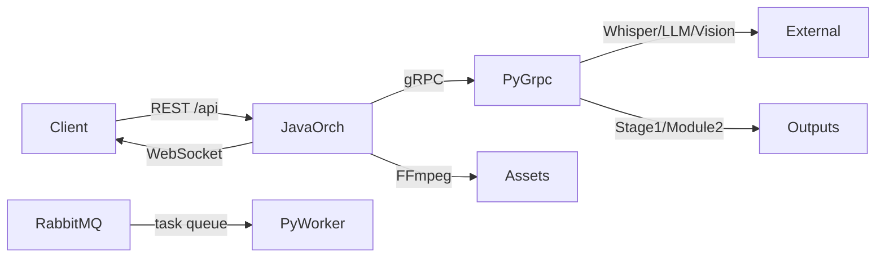

# 系统架构概览

更新日期：2026-02-05
范围：d:/videoToMarkdownTest2

## 系统目标与边界
- 目标：将视频内容转为结构化知识文档（Markdown/JSON），并生成可复用素材（截图/视频片段）。
- 输入：video URL/本地路径、任务优先级、输出目录（统一规则见下）、可选标题。
- 输出：Markdown/JSON + 素材目录（screenshots/clips）+ 中间产物（step2/step6/semantic_units 等）。
- 外部依赖：LLM（DeepSeek/OpenAI 兼容）、Vision AI、Whisper、FFmpeg/JavaCV、RabbitMQ（旁路链路）。

## 路径规范（输出目录统一）
- 统一规则：`outputDir` 必须归一到 `storage/{url_hash}`。
- 约定：以视频 URL 计算 `url_hash`，所有阶段产物落在同一目录，避免跨路径碎片化。
- 当前实现：URL 下载任务已在 Python `DownloadVideo` 中落盘到 `storage/{url_hash}`，Java 在下载后将 `outputDir` 指向视频所在目录。
- 待补齐：本地路径任务仍需按相同规则归一（建议对本地路径做一致性 hash）。

## 高层架构


## 详细流程图（主链路）
```mermaid
flowchart TB
    %% Client/API
    C[Client/SDK] -->|1. POST /api/tasks| REST[VideoProcessingController]
    REST -->|2. submitTask| Q[TaskQueueManager]
    Q -->|3. pollNextTask| W[TaskProcessingWorker]
    W -->|4. processVideo| ORC[VideoProcessingOrchestrator]

    %% Python gRPC
    ORC -->|5. DownloadVideo| GRPC[python_grpc_server.py]
    GRPC -->|6. storage/{url_hash}/video.*| STORE[(storage/{url_hash})]
    ORC -->|7. TranscribeVideo| GRPC
    ORC -->|8. ProcessStage1| GRPC
    ORC -->|9. AnalyzeSemanticUnits| GRPC

    %% CV/LLM parallel
    ORC -->|10. ValidateCVBatch (stream)| CVORCH[CVValidationOrchestrator]
    CVORCH --> GRPC
    ORC -->|11. ClassifyKnowledgeBatch| KLORCH[KnowledgeClassificationOrchestrator]
    KLORCH --> GRPC

    %% Material & assemble
    ORC -->|12. GenerateMaterialRequests| GRPC
    ORC -->|13. FFmpeg screenshots/clips| FFMPEG[JavaCVFFmpegService]
    FFMPEG --> OUT[(outputDir/screenshots + outputDir/clips)]
    ORC -->|14. AssembleRichText| GRPC
    GRPC -->|15. *.md/*.json| OUT

    %% Progress
    ORC -->|progress| WS[TaskWebSocketHandler]
    WS --> C
```

## 组件清单
- API/编排层（Java）
  - `MVP_Module2_HEANCING/enterprise_services/java_orchestrator/`
  - 入口：`controller/VideoProcessingController`
  - 编排：`service/VideoProcessingOrchestrator`
  - 调度与资源治理：`queue/TaskQueueManager`、`worker/TaskProcessingWorker`、`service/AdaptiveResourceOrchestrator`、`service/DynamicTimeoutCalculator`、`scheduler/LoadBasedScheduler`
  - 可靠性：`resilience/`（熔断、重试）
  - 通信：`grpc/PythonGrpcClient`、`websocket/TaskWebSocketHandler`
  - 素材提取：`service/JavaCVFFmpegService`
- 推理/处理层（Python）
  - `python_grpc_server.py`：gRPC 服务端 + 全局资源管理 + CV ProcessPool/SharedMemory
  - `stage1_pipeline/`：LangGraph Stage1 文本清洗与结构化
  - `MVP_Module2_HEANCING/module2_content_enhancement/`：Phase2A/2B 语义分割、素材策略与富文本组装
  - `videoToMarkdown/knowledge_engine/`：视频下载与转写
  - `cv_worker.py`：CV 子进程执行器
- 协议与生成代码
  - `proto/`、`generated_grpc/`
- 旁路工作流（可选）
  - `videoToMarkdown/rabbitmq_worker.py`、`worker_manager.py`

## 接口清单
- REST（Java）
  - `POST /api/tasks`
  - `GET /api/tasks/{id}`
  - `GET /api/tasks/user/{userId}`
  - `DELETE /api/tasks/{id}`
  - `GET /api/stats`
  - `GET /api/health`
  - `POST /api/admin/reset-circuit-breaker`
- WebSocket（Java）
  - `GET /ws/tasks`（推送任务状态/进度）
- gRPC（Java <-> Python）
  - `DownloadVideo`、`TranscribeVideo`、`ProcessStage1`、`AnalyzeSemanticUnits`
  - `ValidateCVBatch`（stream）、`ClassifyKnowledgeBatch`、`GenerateMaterialRequests`
  - `AssembleRichText`、`ReleaseCVResources`、`HealthCheck`
- RabbitMQ（旁路）
  - `video.task.queue`、`result.queue`

## 数据目录清单
- `storage/{url_hash}/`：主链路统一根目录
  - `video.*`：下载的视频
  - `*.srt`：字幕
  - `intermediates/`：CV/分类缓存与中间 JSON
  - `screenshots/`、`clips/`：素材输出
  - `*.md`、`*.json`：最终文档
- `outputDir/`：主链路输出目录（统一规则后应等同 `storage/{url_hash}`）
- `worker_output/{task_id}/`：RabbitMQ 旁路产物
- `config.yaml` / `.env`：运行配置与密钥

## 调用链（主链路）
1. Client POST `/api/tasks` -> `VideoProcessingController` -> `TaskQueueManager.submitTask`。
2. `TaskProcessingWorker` 轮询任务 -> `VideoProcessingOrchestrator.processVideo`。
3. gRPC `DownloadVideo` -> `VideoProcessor.download` -> `storage/{url_hash}/video.*`，Java 更新 `outputDir` 为该目录。
4. gRPC `TranscribeVideo` -> `Transcriber` -> 字幕输出。
5. gRPC `ProcessStage1` -> `stage1_pipeline.run_pipeline` -> step2/step6 + sentence timestamps（sentence_timestamps 由 step4_clean_local 生成，Stage1 会复制到 intermediates 并返回路径；若缺失将补跑至至少 step4）。
6. gRPC `AnalyzeSemanticUnits`（Phase2A）-> 语义单元 JSON + 初步素材请求。
7. Java 并行验证：`ValidateCVBatch`（CV）+ `ClassifyKnowledgeBatch`（LLM）。
8. gRPC `GenerateMaterialRequests` -> 生成截图/切片策略。
9. Java `JavaCVFFmpegService.extractAllSync` -> `outputDir/screenshots` + `outputDir/clips`。
10. gRPC `AssembleRichText`（Phase2B）-> `RichTextPipeline` -> `outputDir/*.md` + `*.json`。
11. `TaskQueueManager` 更新状态 -> WebSocket 推送 -> Client。

## 调用链（旁路）
1. 任务写入 `video.task.queue`。
2. `videoToMarkdown/rabbitmq_worker.py` 消费任务。
3. `VideoProcessor` 下载 -> `Transcriber` 转写 -> `stage1_pipeline.run_pipeline`。
4. 进度/结果写入 `result.queue`。

## 决策链
- 任务优先级与公平性：`TaskQueueManager`（VIP/HIGH/NORMAL/LOW + FIFO）。
- 是否派发任务：`LoadBasedScheduler` 根据 CPU/内存状态暂停/限流。
- 并发规模：`AdaptiveResourceOrchestrator` 动态调整 Semaphore；Python CV ProcessPool 根据 RAM/CPU 设定 worker 数。
- 超时阈值：`DynamicTimeoutCalculator` 基于视频时长计算各阶段超时。
- CV 模态判定：`CVKnowledgeValidator.detect_visual_states` 产出 stable islands / action units -> modality/knowledge_subtype。
- 知识类型判定：`KnowledgeClassificationOrchestrator` 批量调用 LLM，失败由熔断/重试保护。
- 素材策略：`GenerateMaterialRequests` 根据 CV 结果 + 知识类型决定截图 vs 片段。
- 素材质量筛选：`ScreenshotSelector` / `VideoClipExtractor` 内部策略选择最优帧/片段。
- 缓存复用：CV/分类结果写入 `outputDir/intermediates`，重复任务可复用。
- 资源释放：`ReleaseCVResources` 主动回收 CV 资源，降低内存占用。

## 关键技术要点
- Java-Python 分层：Java 负责编排与 FFmpeg，Python 负责模型推理与文本/语义处理。
- gRPC 合约驱动：`proto/video_processing.proto` 统一跨语言接口。
- 并行与资源治理：Java 侧 Semaphore + Python 侧 ProcessPool + SharedMemory 避免 GIL。
- LLM 调度与批处理：集中式 LLMClient（连接池/HTTP2）+ token 加权 permits + 资源 cap；批量任务优先合并为 JSON Array Prompt，或用 `asyncio.as_completed` 流式消费并发结果以降低单任务时延。
- Stage1 使用 LangGraph + checkpoint，支持中断恢复与中间产物持久化。
- 可靠性：Circuit Breaker + Retry + 动态超时，降低 LLM/远程服务抖动。
- 输出可追溯：保留 step2/step6/semantic_units 等中间产物便于回放与调试。

## 技术考量（当前权衡）
- 性能 vs 成本：CV/LLM 并行提高吞吐，但受内存与 API 配额约束。
- 准确性 vs 时延：多阶段验证（CV + LLM）提高质量，但延长总耗时。
- 跨进程成本：素材提取放在 Java 侧，避免 Python 端跨进程 I/O。
- 可恢复性：Stage1 checkpointer 与中间产物保存，降低长任务失败损耗。
- 可扩展性：gRPC/REST 边界清晰，后续可替换模型或扩展服务。

## 运行说明与启动顺序（主链路）
1. 安装依赖
   - Python：`videoToMarkdown/requirements.txt` + `MVP_Module2_HEANCING/requirements.txt`
   - Java：`MVP_Module2_HEANCING/enterprise_services/java_orchestrator/pom.xml`
2. 配置密钥与环境
   - `.env` 或 `config.yaml` 中设置 `DEEPSEEK_API_KEY`、`VISION_API_KEY` 等
3. 生成 gRPC 代码（仅在 proto 更新时）
   - 运行：`generate_grpc.bat`
4. 启动 Python gRPC 服务
   - 运行：`python python_grpc_server.py`（默认端口 50051）
5. 启动 Java Orchestrator
   - 运行：在 `MVP_Module2_HEANCING/enterprise_services/java_orchestrator` 执行 `mvn spring-boot:run` 或用 IDE 启动 `FusionOrchestratorApplication`
6. 提交任务并观察进度
   - REST 调用 `/api/tasks`
   - WebSocket 订阅 `/ws/tasks` 接收进度

## 可复用资产（杠杆）
- 统一 gRPC 合约 + 生成代码（`proto/`, `generated_grpc/`）。
- Stage1 LangGraph pipeline 与节点复用。
- Module2 content enhancement 的分段/素材/组装能力。
- Java 侧 FFmpeg/JNI 封装与资源调度。
- CV/分类缓存机制与资源管理器。

## 待确认
- RabbitMQ Worker 是否仍为线上链路，还是仅保留做回放/回归？
