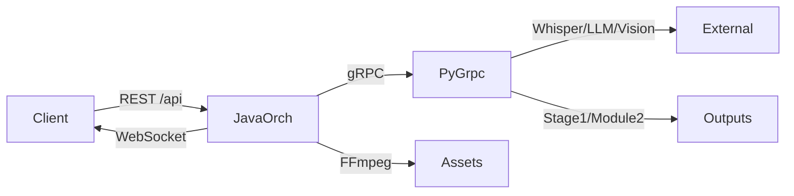

# 系统架构概览

更新日期：2026-02-09  
范围：`D:/videoToMarkdownTest2`

## 系统目标与边界
- 目标：将视频内容转为结构化知识文档（Markdown/JSON），并生成可复用素材（截图/视频片段）。
- 输入：video URL/本地路径、任务优先级、输出目录、可选标题。
- 输出：Markdown/JSON + 素材目录（screenshots/clips）+ 中间产物（step2/step6/semantic_units 等）。
- 外部依赖：LLM（DeepSeek/OpenAI 兼容）、Vision AI、Whisper、FFmpeg/JavaCV、Qwen3-VL-Plus。

## 路径规范（输出目录统一）
- 统一规则：`outputDir` 归一到 `var/storage/{url_hash}`（兼容读取历史 `storage/{url_hash}`）。
- 约定：以视频 URL 计算 `url_hash`，全阶段产物落在同一目录，避免跨路径碎片化。

## 高层架构

## 组件清单
- API/编排层（Java）
  - `services/java-orchestrator/`
  - 入口：`controller/VideoProcessingController`
  - 编排：`service/VideoProcessingOrchestrator`
  - 调度与资源治理：`queue/TaskQueueManager`、`worker/TaskProcessingWorker`、`service/AdaptiveResourceOrchestrator`、`service/DynamicTimeoutCalculator`、`scheduler/LoadBasedScheduler`
  - 可靠性：`resilience/`（熔断、重试）
  - 通信：`grpc/PythonGrpcClient`、`websocket/TaskWebSocketHandler`
  - 素材提取：`service/JavaCVFFmpegService`
- 推理/处理层（Python）
  - `apps/grpc-server/main.py`：Python gRPC 薄入口
  - `services/python_grpc/src/server/`：服务导出层 + 入口编排层 + 启动执行层 + 依赖预检层
  - `services/python_grpc/src/transcript_pipeline/`：Stage1 文本清洗与结构化
  - `services/python_grpc/src/content_pipeline/`：Phase2A/2B 语义分割、素材策略与富文本组装
  - `services/python_grpc/src/media_engine/knowledge_engine/`：下载与转写
  - `services/python_grpc/src/worker/`：Worker 运行入口与执行流程
  - `services/python_grpc/src/vision_validation/worker.py`：CV 并行执行器
- 协议与生成代码
  - `contracts/proto/video_processing.proto`
  - `contracts/gen/python/`

## 主链路调用
1. `POST /api/tasks` 提交任务到 Java 编排层。
2. Java 通过 gRPC 调用 Python `DownloadVideo`、`TranscribeVideo`、`ProcessStage1`。
3. Python 在 `var/storage/{url_hash}/` 产出字幕与中间文件。
4. Java 调用 `AnalyzeSemanticUnits`，并并行触发 `ValidateCVBatch` 与 `ClassifyKnowledgeBatch`。
5. Java 执行素材提取（截图/切片），再调用 `AssembleRichText` 生成最终文档。
6. Java 更新任务状态并通过 WebSocket 推送进度。

## 迁移状态（2026-02-09）
- 四个历史兼容壳目录已全部删除，运行链路仅保留新分层目录。
- Python 运行时 proto 统一来源：`contracts/gen/python/`。
- 历史文档已迁移到：`services/python_grpc/src/docs/legacy/`。
- 历史依赖清单已迁移到：`requirements/legacy/`。

## 接口清单
- REST（Java）：`/api/tasks`、`/api/tasks/{id}`、`/api/tasks/user/{userId}`、`/api/stats`、`/api/health`
- WebSocket（Java）：`/ws/tasks`
- gRPC（Java <-> Python）：`DownloadVideo`、`TranscribeVideo`、`ProcessStage1`、`AnalyzeSemanticUnits`、`ValidateCVBatch`、`ClassifyKnowledgeBatch`、`GenerateMaterialRequests`、`AssembleRichText`、`ReleaseCVResources`、`HealthCheck`

## 技术要点
- Java-Python 分层：Java 负责编排与素材工程化，Python 负责模型推理与文本语义处理。
- 合约驱动：统一由 `contracts/proto/video_processing.proto` 驱动跨语言接口。
- 并行治理：Java 侧调度限流 + Python 侧并发执行与资源管理。
- 可追溯性：保留 step2/step6/semantic_units 等中间产物，支持回放与诊断。
